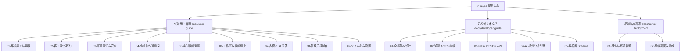

# Pureyes (清眸) 鸿蒙多模态视觉监控与分析系统

欢迎来到 **Pureyes (清眸)** 官方代码仓库。本系统是基于 HarmonyOS 5.0 (ArkTS) 架构打造的智能化多模态视觉监控与分析平台，融合了多模态视觉大语言模型 (支持用户自定义配置 API Key / Base URL)、YOLOv8 实时目标检测与 OSNet Person ReID 跨镜头行人重识别算法，旨在为安防巡检、智能监控、团队协作与视频内容检索提供一站式解决方案。

---

## 文档全景导航

本帮助中心根据使用者角色的不同，拆分为三大独立板块：

### 1. 终端用户指南 (docs/user-guide)
适合项目使用人员、巡检员、小组组长及系统管理员：
- [01-系统简介与核心特性](./docs/user-guide/01-overview.md)
- [02-客户端快速入门](./docs/user-guide/02-quick-start.md)
- [03-账号认证与安全设置](./docs/user-guide/03-authentication.md)
- [04-小组协作与团队通讯录](./docs/user-guide/04-group-collaboration.md)
- [05-实时视频监控与历史回放](./docs/user-guide/05-live-monitoring.md)
- [06-工作区管理与视频切片](./docs/user-guide/06-workspace-management.md)
- [07-智能多模态视觉问答](./docs/user-guide/07-ai-multimodal-qa.md)
- [08-管理员控制台与用户管理](./docs/user-guide/08-admin-console.md)
- [09-个人中心与大模型 API 设置](./docs/user-guide/09-profile-and-settings.md)

### 2. 开发者技术文档 (docs/developer-guide)
适合前端、后端与算法开发工程师：
- [01-系统整体架构设计与数据流](./docs/developer-guide/01-architecture-design.md)
- [02-鸿蒙前端 ArkTS 架构与组件设计](./docs/developer-guide/02-frontend-arkts.md)
- [03-后端 RESTful API 接口规范详解](./docs/developer-guide/03-backend-flask-api.md)
- [04-AI 多模态视觉分析引擎原理](./docs/developer-guide/04-ai-mva-engine.md)
- [05-数据库设计与实体关系模型](./docs/developer-guide/05-database-schema.md)

### 3. 自建服务器部署手册 (docs/server-deployment)
适合运维工程师及有私有化部署需求的团队：
- [01-服务器硬件配置与环境依赖](./docs/server-deployment/01-requirements-and-env.md)
- [02-后端服务部署与运行维护](./docs/server-deployment/02-backend-deployment-guide.md)

---

> [!TIP]
> **快速上手建议**：
> - 普通使用人员请直接阅读 [02-客户端快速入门](./docs/user-guide/02-quick-start.md)。
> - 团队管理者请重点参阅 [04-小组协作与团队通讯录](./docs/user-guide/04-group-collaboration.md) 与 [08-管理员控制台](./docs/user-guide/08-admin-console.md)。
> - 二次开发或算法接入人员请转至 [开发者技术文档](./docs/developer-guide/01-architecture-design.md)。
