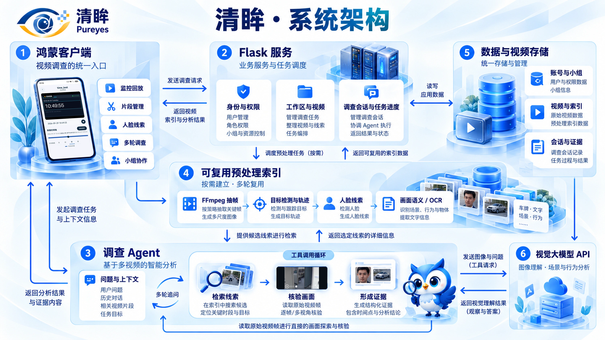
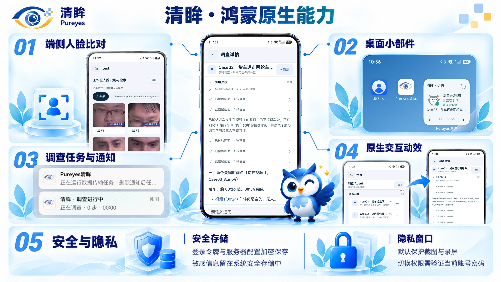

# Pureyes 清眸

面向 HarmonyOS 的小组视频调查应用。成员在工作区整理多个监控或上传视频的片段，提出问题，查看 Agent 的工具执行记录、证据时间点与回答，并在同一调查中继续追问。

## 主要功能

| 功能 | 使用方式 |
| :--- | :--- |
| 小组协作 | 选择小组，共享监控、工作区与调查记录；组长邀请成员。 |
| 视频与片段 | 接入监控或上传视频，在工作区截取片段并按需建立检索索引。 |
| 手机本地上传 | 从相册或文件选择视频，上传后预览、截取并选择 AI 预处理参数。 |
| 多视频调查 | 在一轮问题中选择多个片段，查看工具步骤、视频时间点及 Markdown 回答。 |
| 连续追问 | 已加入小组的成员可在上一轮结束后追问；运行中可停止本轮。 |
| 调查过程与管理 | 实时展示工具步骤与模型进度简报，保留每轮用时、引用片段；有权限的成员可改标题或删除会话。 |
| 通知与桌面小鸮 | 调查进度与结果通知，2×2 / 2×4 服务卡片支持多任务切换、手动刷新与空闲总览；后台同步受系统限制。 |
| 人脸线索 | 按片段查看与调整人脸分组；实际归类方式由服务端配置。 |
| 模型配置 | 个人维护自己的 API 配置，小组长可建立供本组使用的配置。 |

实际界面见[功能截图导览](docs/user-guide/11-interface-tour.md)，卡片与通知的使用边界见[用户说明](docs/user-guide/10-investigation-notifications.md)。

## 协作工作区

小组成员共享片段库、人脸线索和调查记录。来自监控与本地上传的视频汇集到工作区，成员可沿用同一证据范围继续追问，并通过时间点回到原视频。

## 鸿蒙原生能力

端侧人脸比对、桌面小部件、调查任务通知、ArkUI 交互动效，以及安全存储与隐私窗口，共同连接手机内的调查与桌面上的任务状态。

使用方法见[通知与桌面小部件](docs/user-guide/10-investigation-notifications.md)，接入方式见[鸿蒙原生能力](docs/developer-guide/06-harmonyos-native-features.md)。

## 文档入口

- [在线使用说明](http://116.62.178.139/) · [快速开始](docs/user-guide/02-quick-start.md) · [调查问答](docs/user-guide/07-ai-multimodal-qa.md)
- [开发者文档](docs/developer-guide/01-architecture-design.md) · [Agent 工具与运行机制](docs/developer-guide/04-ai-mva-engine.md)
- [服务器部署](docs/server-deployment/01-requirements-and-env.md) · [部署步骤](docs/server-deployment/02-backend-deployment-guide.md)

用户界面中的“使用说明”入口也会打开在线文档。首次使用需要管理员提供账号，并选择或加入小组；没有小组时可在【我的】创建小组或接受邀请。

## 仓库结构

| 路径 | 内容 |
| :--- | :--- |
| `frontend/` | HarmonyOS ArkTS 客户端 |
| `backend/` | Flask API、视频处理、检索与调查 Agent |
| `docs/user-guide/` | 面向用户和管理员的操作说明 |
| `docs/developer-guide/` | 前后端与 AI 模块设计 |
| `docs/server-deployment/` | 环境、模型文件和部署维护 |
