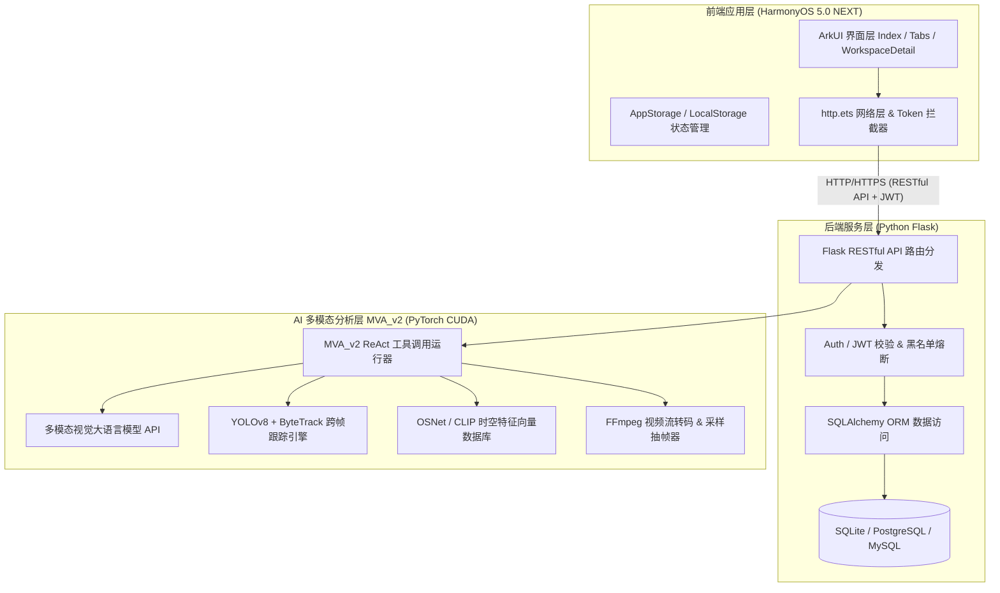
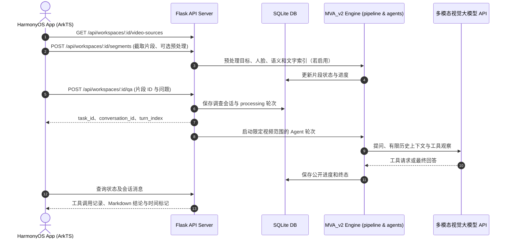

# 01-系统全局架构设计与数据流

本文面向软件架构师与系统工程师，详细阐述 Pureyes 鸿蒙多模态视觉监控与分析系统的分层架构、通信协议与端到端数据流向。

---

## 1. 全局分层架构图

系统采用前后端分离与云端大模型 API 的分层架构。工作区调查由 MVA_v2 的 ReAct 工具调用运行器驱动，前端展示多轮会话与公开执行记录：

---

## 2. 端到端数据流演进

以用户在客户端提出“查找视频中穿红衣服的人”为例，整体数据流流动如下：

---

## 3. 通信协议与数据格式

- **传输协议**：HTTP/1.1 与 HTTP/2；生产部署必须在反向代理层启用 HTTPS。
- **数据交互格式**：主要接口使用 JSON；视频上传使用 `multipart/form-data`，进度流使用 SSE。
- **静态资源与流媒体**：
  - 抓拍快照与缩略图：使用服务端签发的限时 `media_token` 地址。
  - 视频切片流：`/api/video/...` 支持 HTTP Range 请求；每次访问同时校验签名范围和当前小组成员关系。
