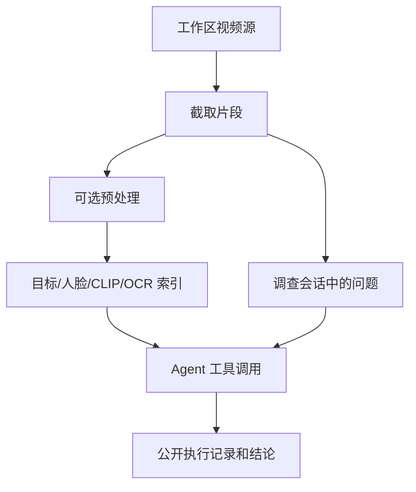

# 04-AI 多模态视觉分析与调查 Agent

工作区的视频先被截取为片段，可选择在后台建立目标轨迹、人脸、画面语义和 OCR 文字等索引。提问时，`MVA2Runner` 在本轮选定的视频范围内调用工具并核验线索，最终生成带视频时间标记的回答。预处理与问答是不同的任务：未预处理的片段仍可被选择，但依赖索引的检索可能没有结果。

## 1. 数据与运行流程

`backend/app/mva_v2/pipeline.py` 负责视频的按帧处理与索引，`database.py` 提供特征查询。默认由 `runner.py` 调用 `native_agent.py` 中的原生函数调用循环；`agents.py` 提供工具实现和旧版 JSON/ReAct 提示词。每轮启动时已读取所选片段的时长、帧率、总帧数，并连同索引状态直接写入 Agent 初始上下文，无需工具调用。默认路径还会自动查询所选视频的目标索引作为初始线索，此步骤不出现在模型主动调用的工具记录里。Agent 的工具请求需限定在该轮选定的视频；非法的视频 ID 或越界时间会被拒绝。运行过程通过回调写入进度快照，供工作区任务状态和会话消息接口读取。

## 2. 可用工具

| 工具 | 功能 | 使用条件与结果 |
| :--- | :--- | :--- |
| `search_objects` / `spatiotemporal_search` | 检索物体、人物和轨迹记录 | 默认路径在开始时自动查询目标索引，不向模型开放重复检索；旧版回退路径可调用 `search_objects` / `spatiotemporal_search` |
| `track_target` | 按已有 track ID 延伸轨迹 | 从检索所得目标标识继续查询 |
| `search_visual_semantics` | 用 CLIP 文本向量找相似画面 | 依赖本地语义模型及该片段的语义索引，结果需看帧核验 |
| `search_visual_semantics_batch` | 对同一视频一次检索多个画面语义条件 | 最多 4 个条件；逐项返回候选，仍需看帧核验 |
| `search_video_text` | 检索画面中的 OCR 文字 | 依赖 OCR 索引，结果可能有识别误差 |
| `search_face_tracks` | 查询所选片段的人脸出现记录 | 用作视觉线索，不能直接认定真实身份 |
| `read_frame_image` | 截取指定时间的画面送给视觉模型核验 | 限定在所选视频和有效时间内；附近有目标索引时可叠加检测框 |
| `read_frames` | 一次读取多个所选视频的时间点，供视觉模型对照 | 每次最多 4 张，验证视频、时间范围和重复项；返回分别可跳转的证据入口 |

`search_objects` 和 `track_target` 在运行器中复用 `spatiotemporal_search` 的底层查询。默认工具列表还会按问题类型筛选：例如非文字问题不会提供 OCR 工具，非人脸问题不会提供人脸工具。工具结果是候选证据；具体能够使用哪些索引，取决于部署的模型和该片段是否完成相应预处理。临时抽出的单帧用于当轮模型核验，回答不会自动附带可下载的关键帧或框图。批量抽帧中的单张失败会保留其余成功画面的链接；全部失败时标记调用失败，不把失败画面算作已探索。

多视频调查时，默认路径提示模型在工具参数里为每段视频评估与问题的相关性和已有证据的充分度（均为 0–1），评分是可选的。运行器据此计算 `相关性 × (1 − 证据充分度)`，并给尚未探索的视频少量探索加成；工具反馈后按优先级向模型提示下一步值得核验的视频。未经过工具探索的视频不能凭元数据提高证据充分度，非法评分会被忽略。评分只引导工具选择，不是回答依据；OCR、画面语义工具仍按单视频调用，`read_frames` 则可一次核验多个视频的画面。跨视频关联须结合各视频的实际线索核验。

每次工具反馈同时提取带视频、时间、工具来源的有界证据卡片；模型观看单帧后可在下一轮补充该帧直接可见的简短描述。卡片存于该轮的进度记录，追问时从已完成轮次按当前问题检索、去重，按视频整理后纳入总上下文预算。索引结果标为候选，单帧描述标为待复核的模型观察；它们不能自动证明跨视频身份或事件关联。旧轮次没有证据卡片时继续使用原有工具摘要和回答。评分不作为长期记忆保存，新问题重新评分。

## 3. 会话上下文、进度与结果

每条 `AgentConversation` 在首轮保存固定的片段 ID。每个问题形成一条 `QARecord`，含提问者、状态、轮次、回答、心跳和进度快照。追问开始时，从已结束轮次重建上下文：最近至多 4 轮，加上至多 3 轮关联的较早记录和较早记录的简短索引，整体受约 16000 字符预算限制。失败或停止的轮次只有提问与可用观察，不作为已确认答案。该策略提供有限的连续性，长会话中的旧信息需重新检索核对。

进度中的工具调用和观察会整理成可展示的 `tool_calls`（参数、摘要、时间点、证据链接和状态）；模型内部 `thought` 不返回客户端。提示词要求答案使用 `[video:"1", time:"02:33"]` 形式引用所选视频，以便前端跳转；引用是否符合事实仍应由用户在原视频中核对。同一调查同时只允许一轮运行；组员可停止本轮，失败或超时也会解除占用。默认单轮时限为 1200 秒，可通过 `AGENT_TASK_TIMEOUT_SECONDS` 调整。

`PUREYES_NATIVE_TOOLS` 默认启用原生函数调用。设为 `0` 会切换到旧版 JSON/ReAct 回退循环；该回退路径只支持逐张 `read_frame_image`，不提供默认路径的批量抽帧、逐视频评分和本轮证据卡片写入。部署多视频调查时应保持默认配置。

## 4. 模型与索引配置

- YOLOv8 与 ByteTrack 用于目标检测和连续跟踪；OSNet 用于行人身体特征的重识别。人脸索引使用 OpenCV YuNet 检测关键点、SFace 对齐并提取人脸特征；逐帧分配确保同一轨迹在一帧中只匹配一张脸。人脸分组仍需人工核查。
- 人脸服务端模式采用上述 YuNet/SFace；鸿蒙模式由服务端 OpenCV 初步检测、跟踪并保存抓拍，不进行服务端身份比对。手机读取待归类抓拍，用 [Core Vision Kit `faceComparator`](https://developer.huawei.com/consumer/cn/doc/doccenter-capabilities/api/core-vision-facecomparator-api) 两两比对，把分组指派回传。该 API 返回相似度与同人判断，不返回可供后端统一比较的特征向量。Agent 只检索已归类记录。两种模式均可人工合并或拆分，自动结果均需人工核查。
- CLIP 语义模型由 `CLIP_MODEL_PATH` 指向的本地目录加载；OCR 模型由 `OCR_MODEL_ROOT` 指定。模型缺失时相应索引能力不可用，不会在提问时临时下载。
- 目标、人脸和多模态索引由片段预处理生成；更换模型或补齐权重后，需对片段重新预处理以生成相应索引。部署路径及依赖见[环境说明](../server-deployment/01-requirements-and-env.md)。
