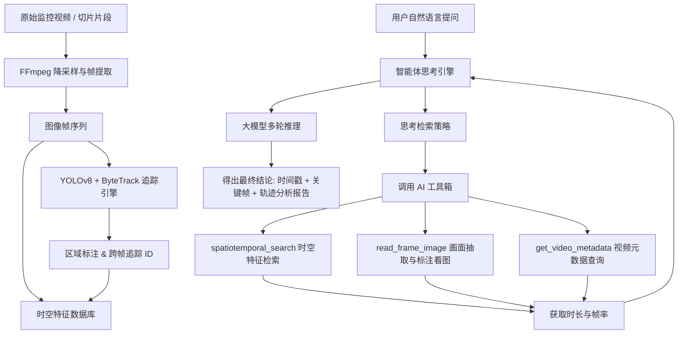

# 04-AI 多模态视觉分析引擎原理

Pureyes 系统核心的多模态视觉分析模块采用基于 ReAct 多智能体协同架构的分析引擎。系统整合了 YOLOv8 目标检测、ByteTrack 跨帧目标追踪、时空特征向量数据库以及多模态视觉大语言模型。

---

## 1. 算法拓扑与决策架构

---

## 2. AI 智能体工具箱详解 (`ReActTools`)

在多轮思考与推理过程中，智能体通过调用以下 3 个核心工具收集并验证视觉证据：

### 2.1 时空特征检索工具 (`spatiotemporal_search`)
- **功能**：检索 YOLOv8 检测与 ByteTrack 跟踪特征库，按语义或目标标识返回匹配轨迹与采样帧。
- **输入参数**：
  - `query_type`：检索类型。可选 `'semantic'`（按行为/大类语义检索）或 `'identity'`（按指定目标追踪 ID 进行 ReID 重识别检索）。
  - `query_text`：检索关键词（如“红衣男子”、“有人跑步”或指定 Track ID）。
  - `video_id`：视频切片文件名。
- **返回值**：匹配到的数据总条数、唯一追踪 ID 列表以及前 15 个代表帧的时间戳、帧序号、标注框坐标与追踪 ID 格式化数据。

### 2.2 单帧画面抽取与视觉验证工具 (`read_frame_image`)
- **功能**：从物理视频文件中抽取特定秒数的高清画面。如果数据库在该秒数附近存在检测到的目标，工具会自动在画面上绘制高亮边界框 (Bounding Box) 与追踪 ID 标签，帮助大模型看清图像细节。
- **输入参数**：
  - `video_path`：视频文件的绝对路径。
  - `timestamp_sec`：目标截图时间（秒）。
  - `video_id`：视频文件名。
- **返回值**：绘制好标注框的临时图像物理路径，供下一轮推理时直接送入大模型视觉感知进行识别。

### 2.3 视频元数据查询工具 (`get_video_metadata`)
- **功能**：获取视频切片的底层基础物理属性。
- **输入参数**：
  - `video_path`：视频文件的绝对路径。
- **返回值**：包含视频总时长（秒）、帧率 (FPS) 与总帧数的 JSON 字典。

---

## 3. 预处理评估与精度建议机制

智能体在生成最终分析结论时，会检查视频切片的预处理元数据（采样帧率、画质分辨率及视频时长）：
- 若视频未进行预处理或采样精度较低，智能体会自动结合视频总时长，在报告末尾向用户提出针对性的建议：“建议提高预处理精度（如提升采样率/分辨率）以获取更精细的时空特征”，并给出预估的预处理耗时。

---

## 4. 核心子系统架构

| 子系统模块 | 文件位置 | 核心功能职责 |
| :--- | :--- | :--- |
| **目标检测与跟踪引擎** | `pipeline.py` | YOLOv8 目标提取与 ByteTrack 消除杂音的跨帧追踪。 |
| **时空向量数据库** | `database.py` | 存储与查询目标位置、时刻及 ReID 余弦相似度特征向量。 |
| **Agent 思考与工具箱** | `agents.py` | ReAct JSON 格式解析、3 大 AI 工具定义与系统提示词构造。 |
| **Agent 循环运行器** | `runner.py` | 驱动思考-工具调用-观察-得出结论的多轮交互并返回结果。 |
