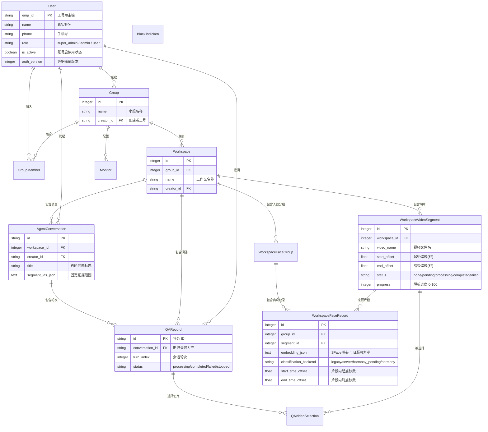

# 05-数据库设计与实体关系模型

Pureyes 后端使用 Flask-SQLAlchemy (ORM) 进行数据持久化，默认使用 SQLite 数据库文件 `backend/user.db`（亦可无缝切换至 PostgreSQL 或 MySQL）。

---

## 1. ER 实体关系图

---

## 2. 核心数据表 Schema 详解

### 2.1 用户表 `users`
| 字段名 | 类型 | 约束 | 说明 |
| :--- | :--- | :--- | :--- |
| `emp_id` | `VARCHAR(64)` | PRIMARY KEY | 工号（全局唯一） |
| `name` | `VARCHAR(64)` | NOT NULL | 真实姓名 |
| `phone` | `VARCHAR(20)` | NULLABLE | 联系电话 |
| `avatar` | `VARCHAR(255)`| NULLABLE | 头像图片相对路径 |
| `password_hash` | `VARCHAR(255)`| NOT NULL | Werkzeug 哈希加密密码 |
| `role` | `VARCHAR(20)` | DEFAULT 'user'| 角色 (`super_admin` / `admin` / `user`) |
| `is_active` | `BOOLEAN` | DEFAULT TRUE | 账号启停用状态标识 |
| `auth_version` | `INTEGER` | DEFAULT 0 | 登出、改密、改角色或停用时递增，使旧 JWT 立即失效 |
| `llm_api_key` | `TEXT` | NULLABLE | Fernet 加密后的个人大模型 API Key；接口永不回传明文 |
| `created_at` | `DATETIME` | DEFAULT UTC | 创建时间 |

### 2.2 小组表 `groups` & 成员表 `group_members`
- `groups`: 包含 `id`, `name`, `creator_id` (外键关联 `users.emp_id`), `created_at`。
- `group_members`: 联合主键 `(group_id, emp_id)`，包含 `status` (`pending`/`accepted`) 与 `joined_at`。

### 2.3 工作区表 `workspaces` & 视频切片表 `workspace_video_segments`
- `workspace_video_segments` 关键字段：
  - `start_offset` / `end_offset`: float 类型截取时间段。
  - `sample_fps`: float 采样帧率（如 1.0）。
  - `resolution`: varchar(32) 分辨率（如 1080P）。
  - `status`: varchar(32) 特征提取状态 (`none`, `pending`, `processing`, `completed`, `failed`)；`none` 表示跳过或删除特征。
  - `progress`: integer (0-100) 异步切片解析百分比。

### 2.4 实时监控表 `monitors`
包含 `id`, `group_id`, `name`, `stream_url` (RTSP/HTTP 流地址), `cover_path` (最新自动快照路径), `status` (`online`/`offline`)。

`workspace_face_groups` 存储工作区内的人脸分组和头像路径；`workspace_face_records` 存储片段 ID、抓拍路径、片段内起止时间、`classification_backend` 及可选的 `embedding_json`（服务端 SFace 特征）。`harmony_pending` 表示等待手机归类。旧记录的特征为空，只有重新预处理才会生成新特征。人脸特征仅在服务端用于比对，不由 API 返回。全局归类模式仅从后端环境变量 `FACE_RECOGNITION_BACKEND` 读取。

### 2.5 调查会话、问答轮次与切片选择
- `agent_conversations` 保存 `id`、`workspace_id`、首轮 `creator_id`、`title`、`segment_ids_json` 以及创建／更新时间。片段 ID 在首轮固定，后续追问沿用。
- `qa_records` 每行代表一轮，包含任务 `id`、工作区、该轮 `creator_id`、`question`、`answer`、`status`（`processing`／`completed`／`failed`／`stopped`）、`progress_json`、`heartbeat_at`、`conversation_id` 和 `turn_index`。旧的单轮记录允许 `conversation_id` 为空。
- SQLite／PostgreSQL 上的部分唯一索引 `uq_qa_active_conversation` 约束同一会话最多一条 `processing` 记录；提交追问还会检查当前运行状态。超时及主动停止写回数据库，释放下一轮提交权限。
- `qa_video_selections` 通过 `record_id` 关联具体轮次，通过 `segment_id` 关联片段；保留 `monitor_id` 和时间范围等兼容字段。工具调用链从轮次的进度记录提取，不单独建表。追问上下文从已保存的轮次重建，并有长度限制。

### 2.6 JWT 黑名单 Token 表 `token_blacklist`
仅保存 `id`, `jti` (JWT 唯一 ID) 与 `created_at`，不存储原始令牌。主动登出同时递增用户的 `auth_version`，因此访问令牌、刷新令牌和媒体令牌都会立即失效；过期黑名单记录会在启动时清理。
