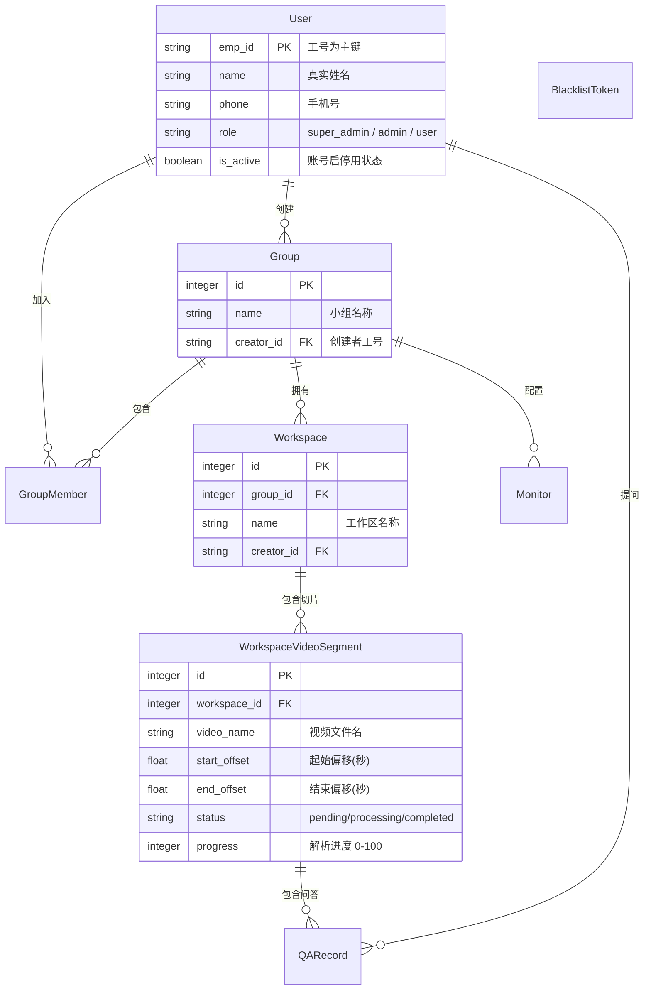

# 05-数据库设计与实体关系模型

Pureyes 后端使用 Flask-SQLAlchemy (ORM) 进行数据持久化，默认使用 SQLite 数据库文件 `backend/user.db`（亦可无缝切换至 PostgreSQL 或 MySQL）。

---

## 1. ER 实体关系图

---

## 2. 核心数据表 Schema 详解

### 2.1 用户表 `users`
| 字段名 | 类型 | 约束 | 说明 |
| :--- | :--- | :--- | :--- |
| `emp_id` | `VARCHAR(64)` | PRIMARY KEY | 工号（全局唯一） |
| `name` | `VARCHAR(64)` | NOT NULL | 真实姓名 |
| `phone` | `VARCHAR(20)` | NULLABLE | 联系电话 |
| `avatar` | `VARCHAR(255)`| NULLABLE | 头像图片相对路径 |
| `password_hash` | `VARCHAR(255)`| NOT NULL | Werkzeug 哈希加密密码 |
| `role` | `VARCHAR(20)` | DEFAULT 'user'| 角色 (`super_admin` / `admin` / `user`) |
| `is_active` | `BOOLEAN` | DEFAULT TRUE | 账号启停用状态标识 |
| `created_at` | `DATETIME` | DEFAULT UTC | 创建时间 |

### 2.2 小组表 `groups` & 成员表 `group_members`
- `groups`: 包含 `id`, `name`, `creator_id` (外键关联 `users.emp_id`), `created_at`。
- `group_members`: 联合主键 `(group_id, emp_id)`，包含 `status` (`pending`/`accepted`) 与 `joined_at`。

### 2.3 工作区表 `workspaces` & 视频切片表 `workspace_video_segments`
- `workspace_video_segments` 关键字段：
  - `start_offset` / `end_offset`: float 类型截取时间段。
  - `sample_fps`: float 采样帧率（如 1.0）。
  - `resolution`: varchar(32) 分辨率（如 1080P）。
  - `status`: varchar(32) 特征提取状态 (`pending`, `processing`, `completed`, `failed`)。
  - `progress`: integer (0-100) 异步切片解析百分比。

### 2.4 实时监控表 `monitors`
包含 `id`, `group_id`, `name`, `stream_url` (RTSP/HTTP 流地址), `cover_path` (最新自动快照路径), `status` (`online`/`offline`)。

### 2.5 JWT 黑名单 Token 表 `blacklist_tokens`
包含 `id`, `jti` (JWT 唯一 ID), `token` (原始令牌), `created_at`。用于支撑账号被管理员停用、重置密码及主动登出时的安全熔断。
