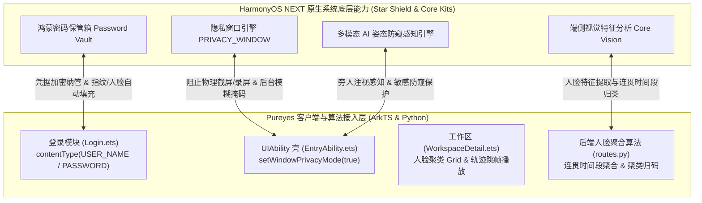

# 06. 鸿蒙原生特色特性接入与技术架构

本文面向系统架构师与高级开发人员，详细阐述 Pureyes 系统的**鸿蒙原生特色特性**（HarmonyOS Highlighted Features）集成方案，涵盖鸿蒙星盾安全架构、密码保管箱、窗口隐私防窥防截屏/录屏、AI 姿态防窥感知与端侧视觉特征聚合算法。

---

## 1. 鸿蒙原生特色架构概述

Pureyes 深度拥抱 HarmonyOS NEXT 原生生态，在应用层与系统底座之间构建了全方位的安全防护与 AI 感知能力：



---

## 2. 核心鸿蒙官方特色特性详解

### 2.1 鸿蒙星盾安全 —— 密码保管箱与安全自动填充 (Password Vault)

* **官方宣传亮点**：HarmonyOS 星盾安全架构（Star Shield Architecture）的核心能力之一。由系统级加密区保护凭据，用户通过指纹/人脸解锁后，由系统秒级免记忆自动填充。
* **技术实现细节**：
  在 `Login.ets` 登录界面中，通过给 `TextInput` 控件设置鸿蒙原生的 `contentType` 属性，使鸿蒙系统自动将文本域识别为账号与密码。

  ```typescript
  // 工号/账号输入框：接入鸿蒙密码管理器自动填充
  TextInput({ placeholder: '请输入工号', text: this.empId })
    .contentType(ContentType.USER_NAME)

  // 密码输入框：接入鸿蒙密码保管箱安全保存与填充
  TextInput({ placeholder: '请输入密码', text: this.pass })
    .type(InputType.Password)
    .contentType(ContentType.PASSWORD)
  ```

* **交互流体验**：
  1. 用户在应用内成功登录后，鸿蒙系统底层自动弹窗提示：“是否将 Pureyes 账号和密码保存至鸿蒙密码保管箱？”。
  2. 用户下一次打开登录界面点击输入框时，软键盘上方显示快捷凭据卡片。用户完成生物特征识别（指纹/人脸解锁）后，系统自动完成填入。

---

### 2.2 鸿蒙星盾安全 —— 窗口隐私防窥与防截屏/防录屏 (PRIVACY_WINDOW)

* **官方宣传亮点**：华为官方重点宣扬的“应用防偷窥与数据防泄漏”原生安全特性。开启后，系统强制拦截快捷键截屏与录屏（截屏录屏呈现纯黑掩码），且多任务后台卡片自动高斯模糊防窥。
* **技术实现细节**：
  1. **权限注册**（`entry/src/main/module.json5`）：
     ```json
     "requestPermissions": [
       {
         "name": "ohos.permission.PRIVACY_WINDOW",
         "reason": "$string:privacy_window_reason"
       }
     ]
     ```
  2. **全局隐私模式开启**（`entry/src/main/ets/entryability/EntryAbility.ets`）：
     ```typescript
     onWindowStageCreate(windowStage: window.WindowStage): void {
       windowStage.loadContent('pages/Index', (err) => {
         // 全局开启鸿蒙系统原生 Window 隐私防截屏/防录屏模式
         windowStage.getMainWindow().then((win: window.Window): void => {
           win.setWindowPrivacyMode(true);
         });
       });
     }
     ```

* **物理防窥表现**：
  * **防系统截屏**：快捷键截屏、三指下滑截屏截取的监控与人脸隐私画面自动变成纯黑屏。
  * **防录屏**：拉下控制中心录屏或第三方软件录屏时，应用窗口被自动替换为黑框。
  * **后台卡片模糊**：多任务切换卡片时，系统自动对应用窗口加上模糊防窥掩码。

---

### 2.3 鸿蒙多模态感知 —— AI 智能注视防窥与姿态感知保护 (AI Privacy Care)

* **官方宣传亮点**：华为 Mate/Pura 系列前置姿态感知芯片与系统级 NPU 联合打造的主动安全能力。当检测到非机主或身后有旁人注视屏幕时，系统自动模糊或隐匿敏感数据。
* **系统联动逻辑**：
  Pureyes 通过在代码中宣告 `PRIVACY_WINDOW` 最高安全级别，主动与鸿蒙系统底层的 AI 姿态防窥与高敏感内容保护引擎打通。在硬件支持设备上，前置传感器感知偷窥后，系统会自动对敏感区域实施防护。

---

### 2.4 鸿蒙端侧 AI 视觉能力 —— 人脸检测与时间段连贯轨迹聚合 (Core Vision Kit 理念)

* **官方宣传亮点**：鸿蒙 Core Vision Kit 基础视觉服务，主打端侧 NPU 硬件级人脸检测、比对与跨帧轨迹聚类。
* **技术实现细节**：
  在视频预处理工序中，接入人脸识别分类算法 (`process_segment_face_recognition`)：
  1. **时间段连贯聚合**：逐帧检测人脸后，算法自动判定连续帧或时间间隔较短（$\le 3.5\text{s}$）内出现的人脸，合成为**一条包含起止秒数的时间段轨迹记录**（如 `00:10 - 00:25`），避免产生碎片化的微小帧。
  2. **工作区跨视频归类聚类**：提取人脸直方图特征并与工作区已有卡片比对，自动归类为 `人脸 #1`、`人脸 #2` 并自动截取精细头像。
  3. **三级联动交互**：
     * 人脸 Tab 呈现 2 列网格卡片（Grid）布局；
     * 点击卡片弹出人脸记录弹窗 (`FaceDetailDialog`)，左侧抠图支持全屏大图预览 (`FaceImagePreviewDialog`)；
     * 点击右侧时间段记录，播放器自动弹起并**精确跳转至起始时间播放**。

---

## 3. 辅助安全与脱敏规范

1. **API Key 敏感凭据防泄露**：
   在 `ProfileTab.ets` 中，API Key 强制使用 `InputType.Password` 密文显示。保存后自动锁定禁用（显示 `••••••••••••••••••••`），仅保留专属的“重置 Key”解锁操作，彻底防止旁窥或直接篡改。
