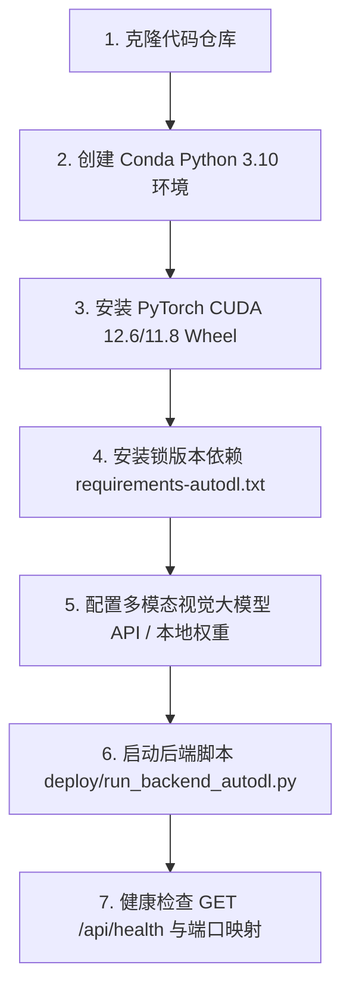

# 02-后端服务部署、大模型配置与运行维护

本指南详细说明如何在 AutoDL、阿里云 GPU 云服务器或本地 Linux GPU 环境中安装部署 Pureyes 后端服务。

---

## 1. 部署全流程一览



---

## 2. 步骤一：克隆代码与初始化 Conda 环境

```bash
# 1. 克隆仓库
cd /root/autodl-tmp
git clone https://github.com/EmadowKy/pureyes-harmony.git
cd pureyes-harmony

# 2. 创建并激活 Conda 环境
conda create -n pureyes python=3.10 -y
conda activate pureyes

# 3. 升级基础包
python -m pip install -U pip setuptools wheel
```

---

## 3. 步骤二：安装 PyTorch GPU Wheel 与后端依赖

建议优先使用 CUDA 12.6 版本的 PyTorch 独立预编译 Wheel：

```bash
# 安装 PyTorch CUDA 12.6 Wheel
pip install torch==2.7.1 torchvision==0.22.1 --index-url https://download.pytorch.org/whl/cu126

# 验证 CUDA 状态 (必须输出 True)
python -c "import torch; print('PyTorch CUDA available:', torch.cuda.is_available()); print('Device Name:', torch.cuda.get_device_name(0) if torch.cuda.is_available() else 'No GPU')"
```

使用锁版本的后端依赖安装库（避免破坏 GPU Wheel）：

```bash
pip install -r backend/requirements-autodl.txt

# 运行环境检查脚本
python deploy/check_env.py
```

---

## 4. 步骤三：配置多模态视觉大模型

后端支持配置云端大模型 API 或本地离线视觉大模型。若使用本地权重文件，建议手动存放在项目根目录 `models/` 下：

```text
pureyes-harmony/
  models/
    your-vision-model/
      config.json
      model.safetensors.index.json
      tokenizer.json
      ...
```

修改配置文件 `backend/configs/model.yaml` 中的模型路径或 API 节点：

```yaml
models:
  main_model_path: "../../models/your-vision-model"
```

若无需外网下载，可开启本地离线环境变量：

```bash
export HF_HUB_OFFLINE=1
export TRANSFORMERS_OFFLINE=1
python deploy/check_env.py
```

---

## 5. 步骤四：启动后端服务与后台运行

使用项目提供的标准部署启动脚本 `deploy/run_backend_autodl.py`：

```bash
# 前台直接启动 (监听 0.0.0.0:6006)
export PORT=6006
export HF_HUB_OFFLINE=1
export TRANSFORMERS_OFFLINE=1
python deploy/run_backend_autodl.py
```

若需开启后台持久化守护进程，可使用 `nohup`：

```bash
mkdir -p logs
nohup python deploy/run_backend_autodl.py > logs/backend.log 2>&1 &

# 实时查看日志
tail -f logs/backend.log
```

---

## 6. 步骤五：服务健康检查

在服务器本地或新终端发起 Curl 健康检查测试：

```bash
curl http://127.0.0.1:6006/api/health
```

**预期输出**：
```json
{
  "code": 0,
  "data": { "service": "backend" },
  "message": "ok"
}
```

> [!NOTE]
> **说明**：健康检查和用户登录接口不需要加载视觉大模型；当客户端发起第一次 MVA 问答检索请求时，服务器才会首次将视觉大模型加载至显存或发起 API 调用。
