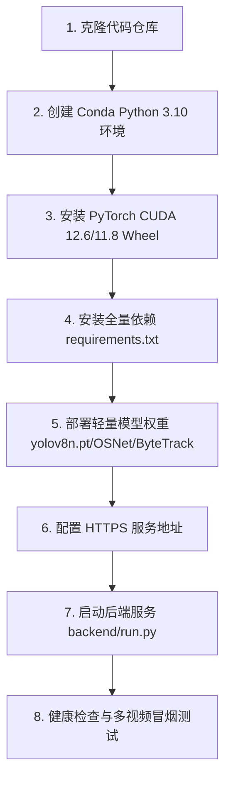

# 02-后端服务部署、轻量模型权重与运行维护

本指南详细说明如何在自建 Linux GPU 服务器或云服务器中安装部署 Pureyes 后端服务，配置轻量模型权重与多模态大模型 API。

---

## 1. 部署全流程一览



---

## 2. 步骤一：克隆代码与初始化 Conda 环境

```bash
# 1. 克隆仓库
git clone https://github.com/EmadowKy/pureyes-harmony.git
cd pureyes-harmony

# 2. 创建并激活 Conda 环境
conda create -n pureyes python=3.10 -y
conda activate pureyes

# 3. 升级基础包
python -m pip install -U pip setuptools wheel
```

---

## 3. 步骤二：安装 PyTorch GPU Wheel 与全量后端依赖

建议优先使用 CUDA 12.6 版本的 PyTorch 独立预编译 Wheel：

```bash
# 安装 PyTorch CUDA 12.6 Wheel
pip install torch==2.7.1 torchvision==0.22.1 --index-url https://download.pytorch.org/whl/cu126

# 验证 CUDA 状态 (必须输出 True)
python -c "import torch; print('PyTorch CUDA available:', torch.cuda.is_available()); print('Device Name:', torch.cuda.get_device_name(0) if torch.cuda.is_available() else 'No GPU')"
```

安装包含 AI 引擎在内的全量后端依赖库：

```bash
pip install -r backend/requirements.txt
```

---

## 4. 步骤三：准备轻量 AI 模型权重与大模型 API 配置

后端运行仅依赖以下轻量 AI 模型权重，大模型推理统一采用 API 方式接入：

1. **YOLOv8 目标检测权重 (`yolov8n.pt`)**：
   - 放置于 `backend/yolov8n.pt` 或项目根目录（约 6.5 MB），也可以用 `YOLO_MODEL_PATH` 指定绝对路径。生产环境不会在运行时自动下载缺失权重。
2. **OSNet 行人重识别权重 (`osnet_x1_0.onnx` / `osnet_x1_0.pth`)**：
   - 放置于 `models/` 目录下。若需转换为 ONNX 格式，可执行脚本 `python convert_osnet.py`。
3. **ByteTrack 多目标追踪配置 (`bytetrack_fixed.yaml`)**：
   - 放置于 `backend/app/mva_v2/bytetrack_fixed.yaml`。
4. **多模态视觉大模型 API 配置**：
   - 用户登录后在客户端【我的】→【模型 API】创建多条个人配置；小组长可以创建小组配置供已加入的组员使用。每轮调查在输入区选择其中一条配置。API Key 加密存储，列表不回传明文。

首次启动前至少设置管理员密码和持久化密钥。密钥一旦用于生产数据后请妥善备份并保持不变，否则已有登录凭据或加密保存的大模型 API Key 将失效：

```bash
export PUREYES_BOOTSTRAP_ADMIN_PASSWORD='替换为强随机密码'
export SECRET_KEY='替换为至少 32 字节的随机值'
export JWT_SECRET_KEY='替换为另一个强随机值'
# Fernet 格式密钥，可用：python -c "from cryptography.fernet import Fernet; print(Fernet.generate_key().decode())"
export DATA_ENCRYPTION_KEY='替换为生成的 Fernet 密钥'
```

如不显式设置这些密钥，服务会在 `backend/.runtime/` 中生成本机密钥；部署迁移和备份时必须连同该目录一起安全迁移。

---

## 5. 步骤四：启动后端服务与后台运行

在 `backend` 目录下启动后端服务（默认只监听 `127.0.0.1:5000`，可用 `PUREYES_PORT` 修改端口）。只有位于隔离容器网络且确需从容器外访问时，才设置 `PUREYES_HOST=0.0.0.0` 并限制端口暴露：

```bash
cd backend
python run.py
```

若需开启后台持久化守护进程，可使用 `nohup`：

```bash
mkdir -p logs
nohup python run.py > logs/backend.log 2>&1 &

# 实时查看日志
tail -f logs/backend.log
```

### 5.1 公网 HTTPS 接入

客户端拒绝向远程 HTTP 地址发送登录和 API 请求；仓库里保留的旧官方 IP 地址为 HTTP，不能直接用于新版本登录。先为服务器准备域名和有效 TLS 证书，再让客户端在登录页切换到自定义服务器并填写 `https://你的域名/api`。未写协议的自定义地址默认按 HTTPS 解析。仅本机 `localhost`、`127.0.0.1` 或 `::1` 允许 HTTP 开发调试。

例如在 Nginx 中终止 TLS，并将请求转发到只对本机开放的 Flask 服务（证书路径与域名按实际部署替换）：

```nginx
server {
    listen 443 ssl;
    server_name your-domain.example;
    ssl_certificate /etc/ssl/your-domain/fullchain.pem;
    ssl_certificate_key /etc/ssl/your-domain/privkey.pem;
    client_max_body_size 2g;

    location / {
        proxy_pass http://127.0.0.1:5000;
        proxy_http_version 1.1;
        proxy_set_header Host $host;
        proxy_set_header X-Forwarded-Proto https;
        proxy_set_header X-Forwarded-For $proxy_add_x_forwarded_for;
        proxy_read_timeout 1250s;
        proxy_buffering off;
    }
}
```

实际部署时用受进程管理器监管的单个应用工作进程；调查线程及录制管理仍有进程内状态。数据库状态可让另一进程看到任务进度与停止请求，视频特征索引会检测磁盘变更，但当前方案并非完整的分布式任务队列。不要直接把 Flask 开发服务器暴露在公网；为代理与应用配置服务管理、重启策略及可观测日志。

---

## 6. 步骤五：服务健康检查

在服务器本地或新终端发起 Curl 健康检查测试：

```bash
curl http://127.0.0.1:5000/api/health
curl https://你的域名/api/health
```

**预期输出**：
```json
{
  "code": 0,
  "data": { "service": "backend" },
  "message": "ok"
}
```

> [!NOTE]
> **说明**：健康检查和用户登录接口不需要调用大模型 API；当客户端发起问答检索请求时，服务器才会首次调用配置的大模型 API 接口发起推理。

要验证真实模型和多视频链路，可在服务器已配置模型权重、已完成片段预处理后运行 `backend/smoke_agent.py`。它会用至少两个片段提交调查，轮询结果，并检查轮次及工具记录。先运行只读预检，再明确指定 `--submit` 才会调用模型 API：

```bash
export PUREYES_SMOKE_URL='https://你的域名/api'
export PUREYES_SMOKE_EMP_ID='测试账号工号'
read -rsp '测试账号密码: ' PUREYES_SMOKE_PASSWORD; export PUREYES_SMOKE_PASSWORD
export PUREYES_SMOKE_WORKSPACE_ID='工作区编号'
export PUREYES_SMOKE_SEGMENT_IDS='片段编号1,片段编号2'
export PUREYES_SMOKE_MODEL_CONFIG_ID='可用配置编号'
python backend/smoke_agent.py
python backend/smoke_agent.py --submit --require-tools --expect '预期出现的事实短语'
```

该测试会实际调用模型 API，应使用专门的测试账号与可控短视频。`--expect` 只检查短语，不代替人工逐帧核对画面、时间点和跨视频结论。
