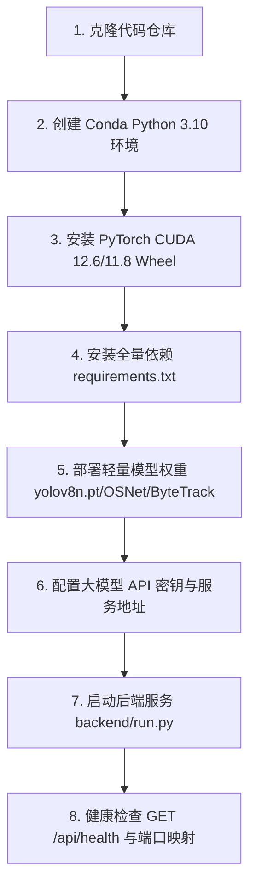

# 02-后端服务部署、轻量模型权重与运行维护

本指南详细说明如何在自建 Linux GPU 服务器或云服务器中安装部署 Pureyes 后端服务，配置轻量模型权重与多模态大模型 API。

---

## 1. 部署全流程一览



---

## 2. 步骤一：克隆代码与初始化 Conda 环境

```bash
# 1. 克隆仓库
git clone https://github.com/EmadowKy/pureyes-harmony.git
cd pureyes-harmony

# 2. 创建并激活 Conda 环境
conda create -n pureyes python=3.10 -y
conda activate pureyes

# 3. 升级基础包
python -m pip install -U pip setuptools wheel
```

---

## 3. 步骤二：安装 PyTorch GPU Wheel 与全量后端依赖

建议优先使用 CUDA 12.6 版本的 PyTorch 独立预编译 Wheel：

```bash
# 安装 PyTorch CUDA 12.6 Wheel
pip install torch==2.7.1 torchvision==0.22.1 --index-url https://download.pytorch.org/whl/cu126

# 验证 CUDA 状态 (必须输出 True)
python -c "import torch; print('PyTorch CUDA available:', torch.cuda.is_available()); print('Device Name:', torch.cuda.get_device_name(0) if torch.cuda.is_available() else 'No GPU')"
```

安装包含 AI 引擎在内的全量后端依赖库：

```bash
pip install -r backend/requirements.txt
```

---

## 4. 步骤三：准备轻量 AI 模型权重与大模型 API 配置

后端运行仅依赖以下轻量 AI 模型权重，大模型推理统一采用 API 方式接入：

1. **YOLOv8 目标检测权重 (`yolov8n.pt`)**：
   - 放置于 `backend/yolov8n.pt` 或项目根目录（约 6.5 MB）。首次运行未发现文件时会自动抓取。
2. **OSNet 行人重识别权重 (`osnet_x1_0.onnx` / `osnet_x1_0.pth`)**：
   - 放置于 `models/` 目录下。若需转换为 ONNX 格式，可执行脚本 `python convert_osnet.py`。
3. **ByteTrack 多目标追踪配置 (`bytetrack_fixed.yaml`)**：
   - 放置于 `backend/app/mva_v2/bytetrack_fixed.yaml`。
4. **多模态视觉大模型 API 配置**：
   - 用户可在客户端【我的】->【大模型 API 设置】界面实时配置个人或企业的 API Key、Base URL 及模型名称；服务器端亦可在环境变量或配置文件中配置默认的大模型 API 节点。

---

## 5. 步骤四：启动后端服务与后台运行

在 `backend` 目录下启动后端的 Flask 服务：

```bash
cd backend
python run.py
```

若需开启后台持久化守护进程，可使用 `nohup`：

```bash
mkdir -p logs
nohup python run.py > logs/backend.log 2>&1 &

# 实时查看日志
tail -f logs/backend.log
```

---

## 6. 步骤五：服务健康检查

在服务器本地或新终端发起 Curl 健康检查测试：

```bash
curl http://127.0.0.1:8000/api/health
```

**预期输出**：
```json
{
  "code": 0,
  "data": { "service": "backend" },
  "message": "ok"
}
```

> [!NOTE]
> **说明**：健康检查和用户登录接口不需要调用大模型 API；当客户端发起问答检索请求时，服务器才会首次调用配置的大模型 API 接口发起推理。
