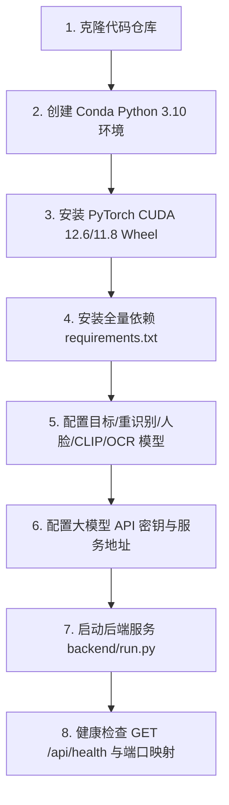

# 02-后端服务部署、轻量模型权重与运行维护

本指南详细说明如何在自建 Linux GPU 服务器或云服务器中安装部署 Pureyes 后端服务，配置轻量模型权重与多模态大模型 API。

---

## 1. 部署全流程一览


```mermaid
graph TD
    A[1. 克隆代码仓库] --> B[2. 创建 Conda Python 3.10 环境]
    B --> C[3. 安装 PyTorch CUDA 12.6/11.8 Wheel]
    C --> D[4. 安装全量依赖 requirements.txt]
    D --> E[5. 配置目标/重识别/人脸/CLIP/OCR 模型]
    E --> F[6. 配置大模型 API 密钥与服务地址]
    F --> G[7. 启动后端服务 backend/run.py]
    G --> H[8. 健康检查 GET /api/health 与端口映射]
```

---

## 2. 步骤一：克隆代码与初始化 Conda 环境

```bash
# 1. 克隆仓库
git clone https://github.com/EmadowKy/pureyes-harmony.git
cd pureyes-harmony

# 2. 创建并激活 Conda 环境
conda create -n pureyes python=3.10 -y
conda activate pureyes

# 3. 升级基础包
python -m pip install -U pip setuptools wheel
```

---

## 3. 步骤二：安装 PyTorch GPU Wheel 与全量后端依赖

建议优先使用 CUDA 12.6 版本的 PyTorch 独立预编译 Wheel：

```bash
# 安装 PyTorch CUDA 12.6 Wheel
pip install torch==2.7.1 torchvision==0.22.1 --index-url https://download.pytorch.org/whl/cu126

# 验证 GPU 部署的 CUDA 状态；CPU 部署输出 False 不代表服务无法启动
python -c "import torch; print('PyTorch CUDA available:', torch.cuda.is_available()); print('Device Name:', torch.cuda.get_device_name(0) if torch.cuda.is_available() else 'No GPU')"
```

安装包含 AI 引擎在内的全量后端依赖库：

```bash
pip install -r backend/requirements.txt
```

---

## 4. 步骤三：准备轻量 AI 模型权重与大模型 API 配置

完整预处理需要按能力配置以下模型，大模型推理统一采用 API 方式接入。权重清单与路径变量以[运行环境与配置](01-requirements-and-env.md#_3-轻量化-ai-模型权重与配置文件清单)为准：

1. **YOLOv8 目标检测权重 (`yolov8n.pt`)**：
   - 放置于 `backend/yolov8n.pt` 或项目根目录（约 6.5 MB），也可以用 `YOLO_MODEL_PATH` 指定绝对路径。生产环境不会在运行时自动下载缺失权重。
2. **OSNet 行人重识别权重 (`osnet_x1_0.onnx` / `osnet_x1_0.pth`)**：
   - 放置于 `models/` 目录下。若需转换为 ONNX 格式，可执行脚本 `python convert_osnet.py`。
3. **ByteTrack 多目标追踪配置 (`bytetrack_fixed.yaml`)**：
   - 放置于 `backend/app/mva_v2/bytetrack_fixed.yaml`。
4. **人脸模型或鸿蒙端侧归类**：
   - `server` 模式配置 YuNet 与 SFace；`harmony` 模式由手机端比对归类，需支持 Core Vision Kit 的设备。不能拿 OSNet 身体特征代替人脸模型。
5. **CLIP 和 OCR 本地模型**：
   - 配置 `CLIP_MODEL_PATH` 及 `OCR_MODEL_ROOT`，CLIP 目录含模型与 processor，OCR 目录含检测、识别、分类三个 ONNX 文件。缺失时对应索引不可用，不会在用户提问时临时下载。
6. **多模态视觉大模型 API 配置**：
   - 用户在客户端【我的】→【模型 API】管理个人配置；小组长可建立供本组成员选用的小组配置。每轮调查在问答输入框中选择配置，填写 API Key、Base URL 与模型名称。

首次启动前至少设置管理员密码和持久化密钥。密钥一旦用于生产数据后请妥善备份并保持不变，否则已有登录凭据或加密保存的大模型 API Key 将失效：

```bash
export PUREYES_BOOTSTRAP_ADMIN_PASSWORD='替换为强随机密码'
export SECRET_KEY='替换为至少 32 字节的随机值'
export JWT_SECRET_KEY='替换为另一个强随机值'
# Fernet 格式密钥，可用：python -c "from cryptography.fernet import Fernet; print(Fernet.generate_key().decode())"
export DATA_ENCRYPTION_KEY='替换为生成的 Fernet 密钥'
```

如不显式设置这些密钥，服务会在 `backend/.runtime/` 中生成本机密钥；部署迁移和备份时必须连同该目录一起安全迁移。

---

## 5. 步骤四：启动后端服务与后台运行

在 `backend` 目录下启动后端的 Flask 服务：

```bash
cd backend
python run.py
```

若需开启后台持久化守护进程，可使用 `nohup`：

```bash
mkdir -p logs
nohup python run.py > logs/backend.log 2>&1 &

# 实时查看日志
tail -f logs/backend.log
```

---

## 6. 步骤五：服务健康检查

在服务器本地或新终端发起 Curl 健康检查测试：

```bash
curl http://127.0.0.1:8000/api/health
```

**预期输出**：
```json
{
  "code": 0,
  "data": { "service": "backend" },
  "message": "ok"
}
```

> [!NOTE]
> **说明**：健康检查和用户登录接口不需要调用大模型 API；当客户端发起问答检索请求时，服务器才会首次调用配置的大模型 API 接口发起推理。

## 7. 录像留存与磁盘维护

录像默认写到 `backend/storage/streams/`。部署可将该目录通过受控软链接或挂载放到数据盘，迁移前先备份并确认没有正在写入的文件。不要直接覆盖数据库、运行时密钥或尚在写入的录像。

| 环境变量 | 默认值 | 用途 |
| --- | --- | --- |
| `MONITOR_RECORDING_SEGMENT_SECONDS` | `60` | 内部录像分段秒数；用户界面只展示时间轴。 |
| `MONITOR_RECORDING_RETENTION_HOURS` | `24` | 留存小时数。 |
| `MONITOR_MIN_FREE_DISK_GB` | `2` | 低空间保护阈值。 |
| `MONITOR_RECORDER_SUPERVISOR_SECONDS` | `30` | 录像进程检查间隔，最小 15 秒。 |

清理逻辑避开正在写入、尚在收尾的文件；Linux 使用录像进程锁防止同一设备重复录制。磁盘容量、断流、转码失败都会影响可回放范围。迁移后确认目录实际解析到数据盘、有写入权限，并测试最新录像与历史定位；不要只用 API 健康检查证明录像已保存。

## 8. 编译与发布文档站点

在有 Node.js 与文档依赖的服务器仓库根目录执行：

```bash
git pull --ff-only
npm install
npm run docs:build
```

构建输出为 `docs/.vitepress/dist/`。先检查构建成功和截图文件完整，再将输出内容同步到 Web 服务的文档目录。例如当前演示部署的根目录是 `/var/www/docs`，里面同时包含直播的 `live/`；发布文档不得删除直播目录或使用未经排除规则核对的整目录清空操作。

仅修改 Markdown、文档主题和截图，不需要重启后端或录像进程。更新后分别访问用户指南、新增页面和图片，确认不是旧缓存；涉及后端代码时另行按服务管理方式部署。运行时数据库、权重、上传视频、录像和 `.runtime` 不应进入文档发布包。
