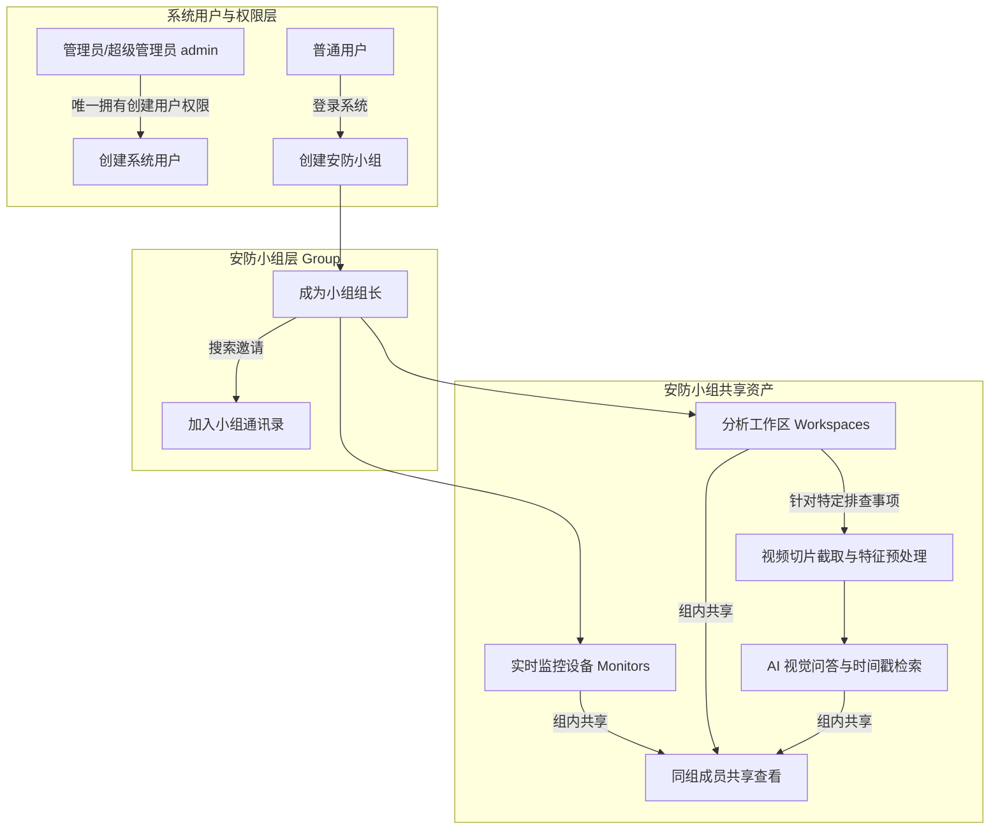

# 01-系统简介与核心特性

Pureyes (清眸) 是一款专门针对鸿蒙系统打造的多模态智能视觉安防与监控分析系统。系统通过将鸿蒙原生的极速 UI 体验与云端高级 AI 视觉大模型、目标检测、跨镜头行人重识别算法深度结合，全面解决传统安防监控中“人眼查视频难、跨镜头检索慢、事后追溯繁琐”的痛点。

---

## 1. 组织架构与资产管理逻辑

Pureyes 建立了清晰、严谨的组织架构与权限隔离体系，整体关系如下图所示：

### 1.1 用户与账号管理
- **管理员独占创建权**：系统中只有管理员或超级管理员具备创建新用户、重置密码、调整角色及启停用账号的权限。系统初始预置账号为 `admin`（密码 `admin`），拥有超级管理员权限。
- **普通用户基本权限**：普通用户由管理员创建后即可登录系统，拥有创建小组、加入小组以及在小组内开展监控与工作区分析的权限。

### 1.2 安防小组
- **小组创建与组长**：任何用户均可创建新的安防小组，创建者自动成为该小组的**组长**。
- **成员邀请与通讯录**：组长可通过工号、姓名或手机号搜索用户卡片，邀请其他注册用户加入小组。
- **数据隔离与组内共享**：小组是资产隔离的基本边界。**同一个小组内的所有成员，均可共享查看该小组下的所有监控设备、工作区、视频切片以及 AI 问答历史记录**。

### 1.3 监控设备
- 摄像头与视频流设备统一存储并归属于特定的安防小组。
- 组内所有成员均可实时播放、查看抓拍封面快照及设备在线状态。

### 1.4 分析工作区与 AI 预处理
- **按“处理一件事”创建**：工作区是针对特定安防事件（例如：“2026-07-23 展厅物品遗失排查”、“大楼消防通道巡检”）专门创建的工作台。
- **视频导入与切片截取**：用户可以在工作区中导入安防视频，并精准截取关注的时间段。
- **特征预处理与抽帧采样**：对切片进行采样帧率与分辨率设置，系统自动完成目标检测与特征提取。
- **AI 自然语言问答**：基于预处理后的视频切片，组内成员可以使用自然语言提问（如“检索穿红衣服的人什么时候出现”），AI 自动精确定位事件时间戳并返回分析报告。

---

## 2. 核心功能特性一览

### 2.1 鸿蒙原生交互设计
- **系统级 Symbol 图标集成**：采用鸿蒙原生系统符号矢量渲染，界面美观流畅。
- **响应式底部 Tab 架构**：内置【监控】、【工作区】、【小组】、【我的】四大核心功能面板。
- **深色模式与主题适配**：原生支持深色主题，适应不同光照环境。

### 2.2 多模态 AI 智能视觉问答
- **自然语言检索视频**：无需拖动进度条，对话式提问即可精准定位事件。
- **自定义视觉大模型 API**：支持用户在【我的】页面中配置个人或企业专属的大模型 API 密钥、接口地址及模型名称，进行灵活推理。
- **目标追踪与跨镜头识别**：配合物体识别与跨镜头行人重识别算法，重构人员移动轨迹。

### 2.3 权限保护与熔断机制
- **三级角色架构**：超级管理员、管理员、普通用户。
- **实时凭据熔断**：密码重置、账号停用或登出时，服务端即刻失效凭据，保障数据安全。

---

> [!NOTE]
> **测试账号提示**：
> 当前测试阶段系统暂不开放自助注册，您可以直接使用初始管理员账号登录体验：
> - **账号 (工号)**：`admin`
> - **密码**：`admin`
