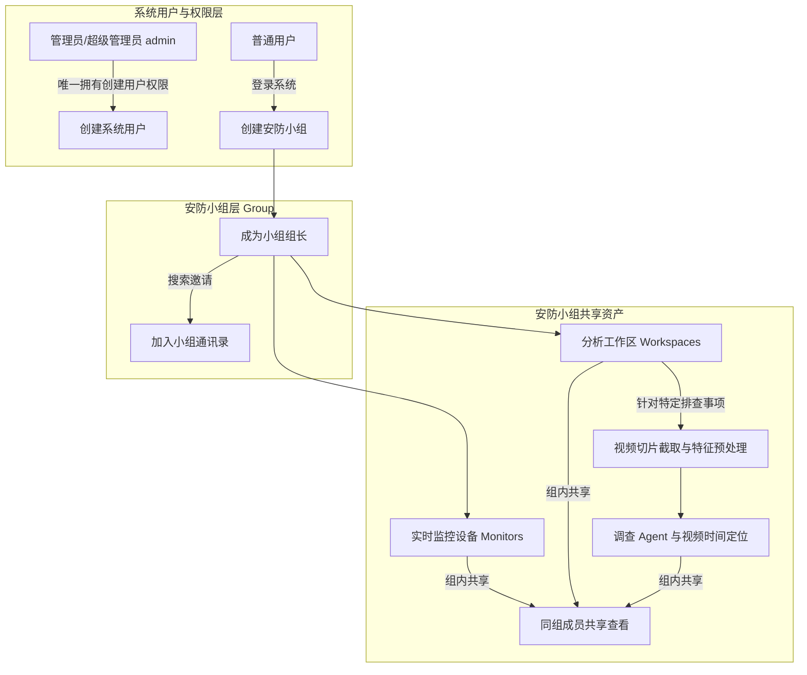

# 01-系统简介与核心特性

Pureyes (清眸) 是一款专门针对鸿蒙系统打造的多模态智能视觉安防与监控分析系统。系统通过将鸿蒙原生的极速 UI 体验与云端高级 AI 视觉大模型、目标检测、跨镜头行人重识别算法深度结合，全面解决传统安防监控中“人眼查视频难、跨镜头检索慢、事后追溯繁琐”的痛点。

---

## 1. 组织架构与资产管理逻辑

Pureyes 建立了清晰、严谨的组织架构与权限隔离体系，整体关系如下图所示：

### 1.1 用户与账号管理
- **管理员独占创建权**：系统中只有管理员或超级管理员具备创建新用户、重置密码、调整角色及启停用账号的权限。首次启动会创建工号为 `admin` 的超级管理员，密码由部署者通过环境变量设置；未设置时会在服务端控制台输出一次性随机密码。
- **普通用户基本权限**：普通用户由管理员创建后即可登录系统，拥有创建小组、加入小组以及在小组内开展监控与工作区分析的权限。

### 1.2 安防小组
- **小组创建与组长**：任何用户均可创建新的安防小组，创建者自动成为该小组的**组长**。
- **成员邀请与通讯录**：组长可通过工号、姓名或手机号搜索用户卡片，邀请其他注册用户加入小组。
- **数据隔离与组内共享**：小组是资产隔离的基本边界。已加入小组的成员可以共享查看同组监控设备、工作区、片段与调查记录；上一轮结束后，组员也可以继续追问。

### 1.3 监控设备
- 摄像头与视频流设备统一存储并归属于特定的安防小组。
- 组内所有成员均可实时播放、查看抓拍封面快照及设备在线状态。

### 1.4 分析工作区与 AI 预处理
- **按“处理一件事”创建**：工作区是针对特定安防事件（例如：“2026-07-23 展厅物品遗失排查”、“大楼消防通道巡检”）专门创建的工作台。
- **视频导入与切片截取**：用户可以在工作区中导入安防视频，并精准截取关注的时间段。
- **可选的特征预处理**：截取时或截取后选择采样帧率与画质，在后台建立可用的目标、人脸、语义与文字索引。
- **调查 Agent**：选定片段后提出问题；查看工具调用、证据时间点和 Markdown 结论。同组成员可在这一轮结束后沿用固定的片段范围追问，运行中可以停止本轮。

---

## 2. 核心功能特性一览

### 2.1 鸿蒙原生交互设计
- **系统级 Symbol 图标集成**：采用鸿蒙原生系统符号矢量渲染，界面美观流畅。
- **响应式底部 Tab 架构**：内置【监控】、【工作区】、【小组】、【我的】四大核心功能面板。
- **深色模式与主题适配**：原生支持深色主题，适应不同光照环境。

### 2.2 多模态 AI 智能视觉问答
- **自然语言检索视频**：查看目标、画面、文字等检索过程，并通过答案中的时间标记跳转视频核对。
- **自定义视觉大模型 API**：每位提问组员在【我的】页面设置自己的 API 密钥、接口地址及模型名称，供本人提交的轮次使用。
- **目标追踪与跨镜头识别**：配合物体识别与跨镜头行人重识别算法，重构人员移动轨迹。

### 2.3 权限保护与熔断机制
- **三级角色架构**：超级管理员、管理员、普通用户。
- **实时凭据熔断**：密码重置、账号停用或登出时，服务端即刻失效凭据，保障数据安全。

---

> [!NOTE]
> **初始管理员提示**：
> 系统暂不开放自助注册。首次部署前请设置 `PUREYES_BOOTSTRAP_ADMIN_PASSWORD`，再使用工号 `admin` 登录；若未设置，请只在首次启动的服务端日志中查看随机生成的一次性密码。
