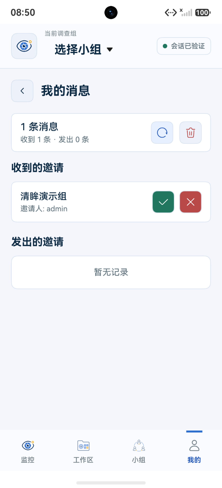
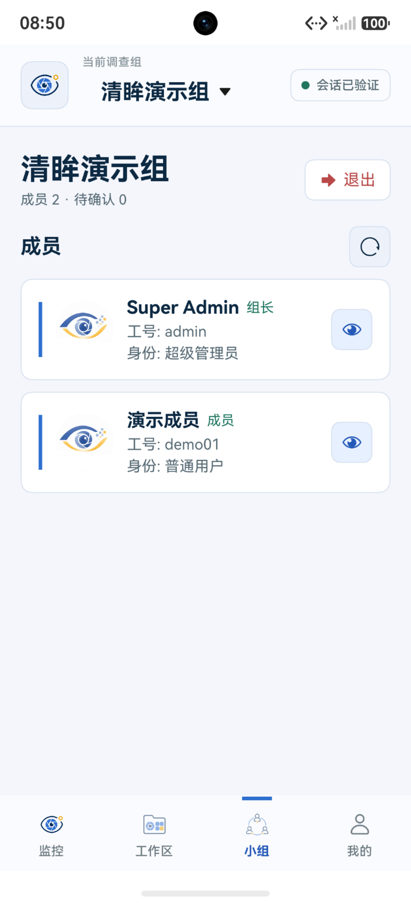
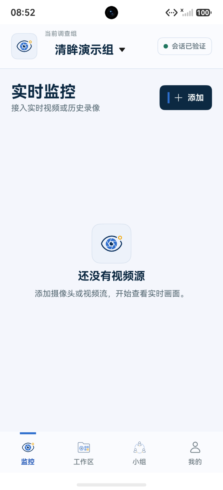

# 清眸用户指南

清眸用于小组共享监控与视频调查。先登录并选择小组，再从【监控】查看画面、从【工作区】整理片段和调查记录、从【小组】查看成员；账号和模型配置在【我的】中管理。

## 按使用场景查找

| 我要做什么 | 阅读哪一篇 |
| :--- | :--- |
| 第一次登录、选择小组、找到主要入口 | [快速开始](02-quick-start.md) |
| 收到邀请、创建小组、查看通讯录 | [小组协作](04-group-collaboration.md) |
| 看实时监控或回放录像 | [监控与回放](05-live-monitoring.md) |
| 截取片段、查看预处理和人脸线索 | [工作区与视频片段](06-workspace-management.md) |
| 对多个片段提问、查看证据、继续追问 | [调查问答](07-ai-multimodal-qa.md) |
| 修改资料、密码或模型配置 | [个人中心](09-profile-and-settings.md)与[账号安全](03-authentication.md) |
| 管理员工账号（仅管理员） | [用户管理](08-admin-console.md) |

> 监控、工作区和小组通讯录需要先选择一个已加入的小组。没有可选小组时，可在【我的】新建小组，或从【我的消息】接受邀请。

## 界面演示

以下截图来自设备上的演示账号与演示小组，仅用于说明界面。演示环境没有接入录像或上传视频，所以截图中没有片段与调查结论。

### 账号与邀请

管理员可在【我的 → 用户管理】创建账号；普通成员使用管理员提供的工号和密码登录。组长发出邀请后，被邀请人到【我的 → 我的消息】接受。详见[小组协作](04-group-collaboration.md)。

| 收到邀请 | 接受后的成员列表 |
| :---: | :---: |
|  |  |

### 工作区与监控

选择小组后，在【工作区】点击【新建】建立一项调查。进入工作区后，可截取视频片段，再在【问答】中选择片段提问。下图中的工作区尚无片段和调查记录。详见[工作区与视频片段](06-workspace-management.md)。

【监控】页可添加摄像头或视频流。下图是尚未接入视频源时的空状态；接入可用视频后，才能查看画面并从录像截取片段。详见[监控与回放](05-live-monitoring.md)。

## 阅读顺序

首次使用建议从[快速开始](02-quick-start.md)入手；进入工作区后，按[片段](06-workspace-management.md) → [调查问答](07-ai-multimodal-qa.md)的顺序操作。管理员只需在管理账号时阅读[用户管理](08-admin-console.md)。
