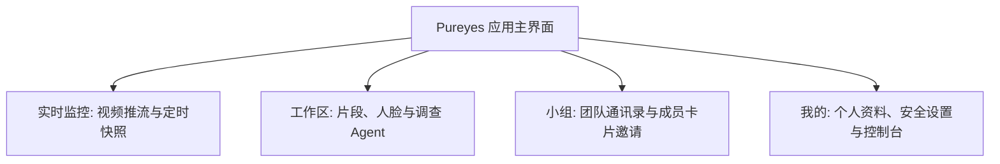

# 02-客户端快速入门

本指南帮助您在鸿蒙设备上快速开始使用 Pureyes 智能安防与视觉分析系统。

---

## 1. 登录与使用前准备

- **适用设备**：支持鸿蒙系统（HarmonyOS）的手机、平板及智能终端设备。
- **网络环境**：请确保设备已连接网络，并向部署者获取已启用 HTTPS 的服务器地址。旧版官方 IP 为明文 HTTP，新版客户端会阻止向该地址发送登录和业务请求。

> [!NOTE]
> **测试账号说明**：
> 当前测试阶段系统暂不开放自助账号注册功能。您可以使用预置的测试账号进行登录体验：
> - **测试账号 (工号)**：`admin`
> - **初始密码**：由部署者通过 `PUREYES_BOOTSTRAP_ADMIN_PASSWORD` 设置；未设置时查看首次启动日志中的一次性随机密码

---

## 2. 账号登录步骤

1. 在鸿蒙设备上打开 **Pureyes** 应用，点击登录页下方的服务器切换入口，填写部署者提供的 `https://.../api` 地址并测试连接。
2. 在登录输入框中填写您的凭据：
   - **工号**：输入您的账号工号（如测试账号 `admin` 或管理员分配的工号）。
   - **密码**：输入部署者分配的密码。
3. 点击 **【登录】** 按钮进入系统主页。

> [!TIP]
> **服务器设置**：
> 公网服务器必须启用 HTTPS；省略协议时按 HTTPS 处理。只有本机回环地址可用 HTTP 调试。未配置有效 HTTPS 地址前，登录按钮会给出明确提示，不会向旧版明文地址提交密码。

---

## 3. 应用主界面与功能导航

登录成功后，您将进入应用主界面。页面底部设有 4 个核心功能面板：

- **实时监控**：查看安防摄像头实时推流、画面抓拍快照与设备在线状态。
- **工作区**：按安防小组共享视频分析资产；截取片段、查看人脸线索、建立调查线，并在前一轮结束后由组员继续追问。
- **小组**：团队通讯录、小组成员管理、候选用户搜索卡片与新增邀请。
- **我的**：个人资料卡片、账号安全（修改密码）、系统消息、设置及管理员控制台。
