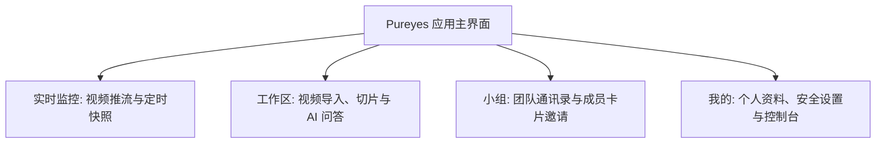

# 02-客户端快速入门

本指南帮助您在鸿蒙设备上快速开始使用 Pureyes 智能安防与视觉分析系统。

---

## 1. 登录与使用前准备

- **适用设备**：支持鸿蒙系统（HarmonyOS）的手机、平板及智能终端设备。
- **网络环境**：请确保您的设备已连接互联网（系统默认自动连接官方服务器，登录界面亦提供“使用自定义服务器”切换入口）。

> [!NOTE]
> **测试账号说明**：
> 当前测试阶段系统暂不开放自助账号注册功能。您可以使用预置的测试账号进行登录体验：
> - **测试账号 (工号)**：`admin`
> - **初始密码**：由部署者通过 `PUREYES_BOOTSTRAP_ADMIN_PASSWORD` 设置；未设置时查看首次启动日志中的一次性随机密码

---

## 2. 账号登录步骤

1. 在鸿蒙设备上打开 **Pureyes** 应用，系统将自动进入登录页面并检测服务器连接状态。
2. 在登录输入框中填写您的凭据：
   - **工号**：输入您的账号工号（如测试账号 `admin` 或管理员分配的工号）。
   - **密码**：输入部署者分配的密码。
3. 点击 **【登录】** 按钮进入系统主页。

> [!TIP]
> **服务器设置**：
> 默认使用官方服务器。如需连接团队自建的私有服务器，可点击登录页下方的 **【使用自定义服务器】**，输入服务器地址并点击重试图标测试连接。

---

## 3. 应用主界面与功能导航

登录成功后，您将进入应用主界面。页面底部设有 4 个核心功能面板：

- **实时监控**：查看安防摄像头实时推流、画面抓拍快照与设备在线状态。
- **工作区**：按安防小组管理视频分析资产，导入视频、进行切片与 AI 多模态自然语言提问。
- **小组**：团队通讯录、小组成员管理、候选用户搜索卡片与新增邀请。
- **我的**：个人资料卡片、账号安全（修改密码）、系统消息、设置及管理员控制台。
