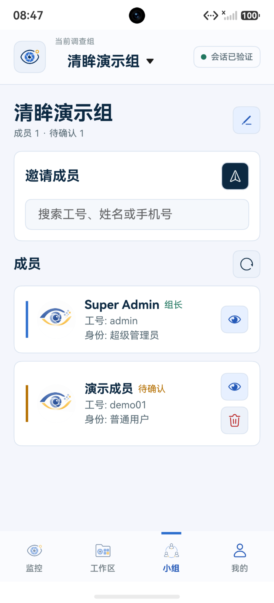
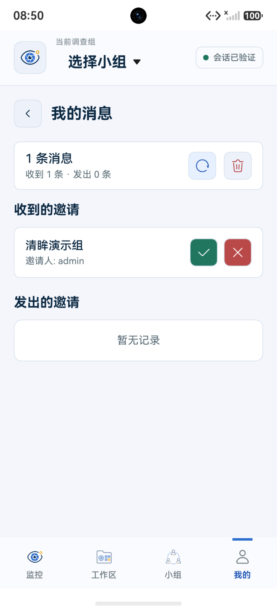
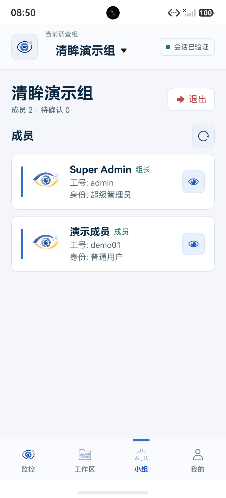

# 04-小组协作与团队通讯录

【小组】是监控设备、工作区和调查记录的共享范围。顶部选择器用于切换已加入的小组；没有加入目标小组的账号不能查看该组资产。

## 1. 创建小组

已登录用户在【我的 → 新建小组】输入名称并点击【创建】。创建者自动成为组长。下方截图使用本地演示数据，组名和成员均不对应真实项目。

## 2. 邀请并接受成员

组长打开【小组】，在【邀请成员】搜索框输入已有用户的工号、姓名或手机号。候选用户出现在输入框下方；选中后点击右上角的发送按钮。发送成功后，用户先以“待确认”状态显示在成员列表中。

被邀请人登录后进入【我的 → 我的消息】，在【收到的邀请】中点击绿色对勾接受，或点击红色叉号拒绝。接受后即可从顶部选择器进入小组。

## 3. 查看与管理成员

小组页显示成员数量、待确认数量，以及成员的姓名、工号和身份。组长可以搜索并邀请成员，也可以撤回待确认邀请或移除成员；普通成员查看通讯录，并可自行退出小组。

组内成员可访问同组监控设备和调查工作区。工作区的创建与使用见[工作区管理](06-workspace-management.md)。
