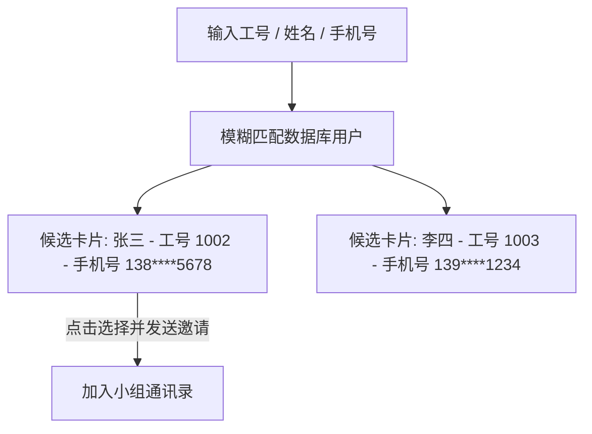

# 04-小组协作与团队通讯录

在 Pureyes 系统中，【小组】是视频监控资产隔离、监控设备共享以及多模态视频分析协作的核心基本单元。所有工作区与监控镜头都挂载于特定的安防小组之下。

---

## 1. 小组概览与通讯录视图

进入底部导航栏【小组】，界面以现代化的团队通讯录卡片呈现：

- **小组选择器**：顶部下拉框显示您当前加入的所有小组。您可以自由切换不同的小组视图。
- **小组信息卡片**：展示小组名称、创建时间以及当前小组的组长信息。
- **成员通讯录列表**：展示组内所有同组成员的姓名、工号、手机号以及角色标识（组长 / 成员）。同组成员可便捷进行内部联系与分工协作。

---

## 2. 创建新小组

如果您需要为新项目、新大楼或新巡检队伍建立独立的安防单元，任何注册用户均可创建小组：

1. 进入【我的】或【小组】界面，点击【新建小组】按钮。
2. 在弹出的模态对话框中输入小组名称（例如：“一号楼安防巡检组”）。
3. 点击确认。创建成功后，您将自动成为该小组的组长。

---

## 3. 邀请成员与候选用户卡片搜索

仅小组组长具备向组内邀请新成员的权限。系统提供了直观防错的候选卡片选择器：

1. 在【小组】界面点击右上角【邀请成员】按钮。
2. 在弹出的搜索框中，支持输入被邀请人的工号、姓名或手机号进行模糊搜索。
3. **候选用户卡片**：输入框下方会实时动态渲染匹配到的候选用户卡片，卡片清晰展示该用户的头像、姓名、工号及手机号。
4. 点击候选卡片即可确认选中该用户，点击【发送邀请】即可完成添加。

---

## 4. 成员管理与小组解散

作为小组组长，您拥有全面的管理权限：

- **移除小组成员**：在通讯录列表中，组长点击成员卡片旁边的移除按钮，即可将该成员移出小组。
- **解散与转让小组**：组长可在小组设置中删除空置小组，该小组关联的工作区及数据将一并归档。

> [!TIP]
> 普通组成员进入小组页面时，界面以只读的“团队通讯录”形式呈现，无法看到邀请与移除按钮，既能满足内部联络需求，又避免了误操作。
