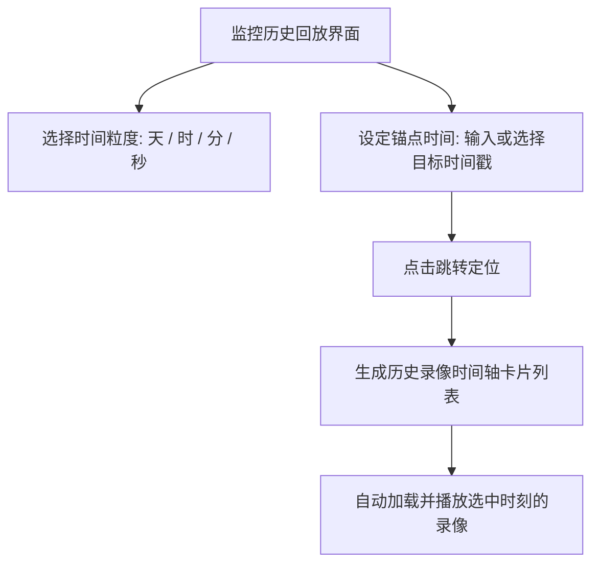

# 05-实时视频监控与历史回放

在 Pureyes 系统中，【监控】模块提供了集网络摄像头管理、实时视频流推流、定时封面快照刷新以及多粒度时间轴历史视频回放于一体的完整监控解决方案。

---

## 1. 监控设备列表网格

进入底部导航栏【监控】页面：

- **小组设备筛选**：顶部自动联动您当前所在的小组，仅展示当前安防小组拥有的摄像头设备。
- **设备网格卡片**：每个监控卡片包含：
  - **摄像头名称**：例如“东门入口高清球机”、“3楼走廊摄像头”。
  - **画面封面快照**：系统后台定期抓取的最新画面缩略图。
  - **在线状态标签**：绿色标示在线，灰色标示离线。
  - **模式切换按钮**：支持在【实时直播】与【历史回放】模式之间自由切换。

---

## 2. 模式一：实时视频直播

- **流媒体播放**：点击监控卡片的播放按钮进入播放模式，实时查看摄像头视频推流。
- **定时封面刷新**：系统后台会定期（每 1 分钟）自动抓取并更新摄像头的封面快照，让您无需点击播放即可了解各监控区域的大致动态。

---

## 3. 模式二：多粒度历史视频回放与时间轴定位

当您需要排查过去某个时间段的监控画面时，可在监控页面切换至 **【历史回放】** 模式：

### 3.1 四级时间粒度筛选
系统提供了 **【天】、【时】、【分】、【秒】** 四种分级筛选粒度：
- **天**：按日期维度（如 2026-07-23）进行大跨度检索，快速跳转至特定日期的监控片段。
- **时**：按小时维度锁定具体时段（如 14:00 - 15:00）。
- **分**：按分钟维度进行细粒度检索（如 14:30）。
- **秒**：按秒级精准跳转至事件发生的准确秒数。

### 3.2 锚点时间跳转与时间轴片段列表
1. **时间输入跳转**：直接在输入框中选择或输入目标日期时间（如 `2026-07-23 14:30:00`），点击【跳转定位】。
2. **时间轴录像片段**：播放器下方会自动生成对应的历史录像切片列表，高亮显示当前正在播放的片段。
3. **连续回放**：点击任意时间段卡片，视频播放器直接自动加载并切换播放该时刻的历史监控录像。

---

## 4. 添加与管理监控摄像头

组长及有权限的用户可在当前安防小组下添加与编辑摄像头：

1. 点击监控界面右上角【新增监控】按钮。
2. 填写摄像头参数信息：
   - **设备名称**：为该摄像头指定清晰易识记的名称。
   - **视频流地址**：支持填写 RTSP、RTMP、HTTP-FLV、HLS 或 MP4 测试视频流地址。
3. 点击【保存并提交】。服务器将自动启动画面拉流、后台录像存储与历史时间轴建立。
