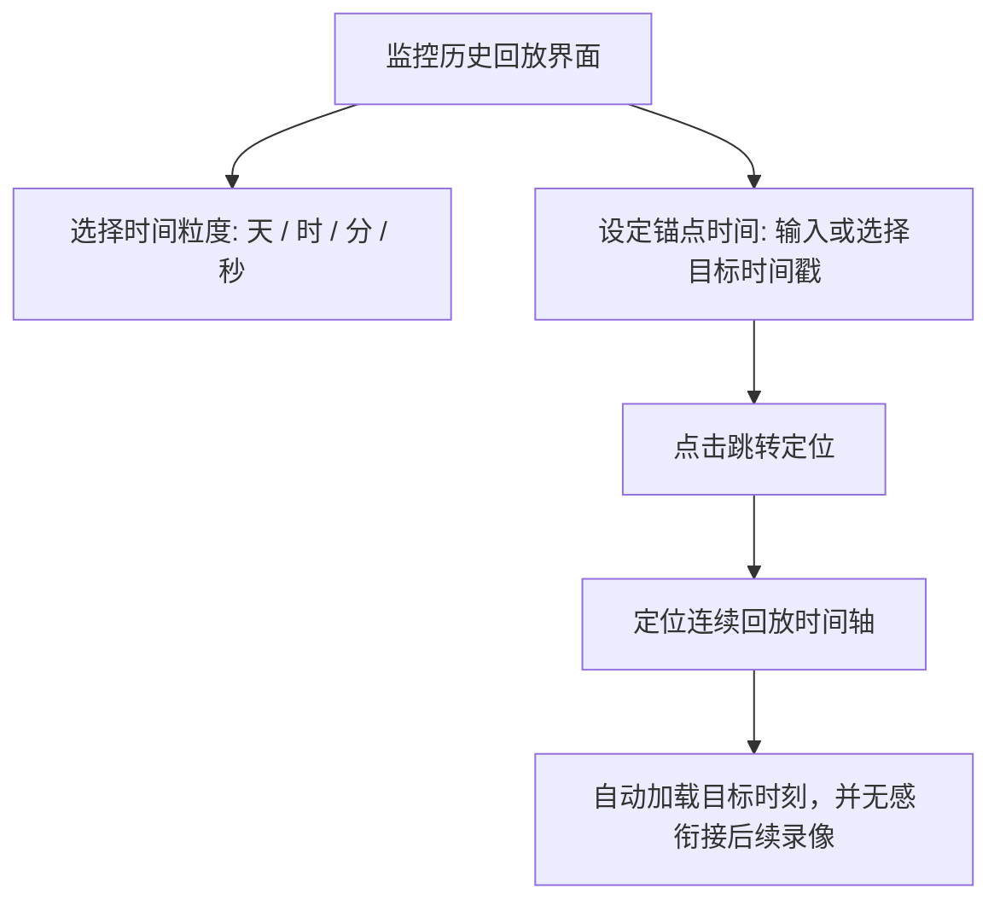

# 05-实时视频监控与历史回放

在 Pureyes 系统中，【监控】模块提供了集网络摄像头管理、实时视频流推流、定时封面快照刷新以及多粒度时间轴历史视频回放于一体的完整监控解决方案。

---

## 1. 监控设备列表网格

进入底部导航栏【监控】页面：

- **小组设备筛选**：顶部自动联动您当前所在的小组，仅展示当前安防小组拥有的摄像头设备。
- **设备网格卡片**：每个监控卡片包含：
  - **摄像头名称**：例如“东门入口高清球机”、“3楼走廊摄像头”。
  - **画面封面快照**：系统后台定期抓取的最新画面缩略图。
  - **在线状态标签**：绿色标示在线，灰色标示离线。
- **模式切换按钮**：支持在【实时直播】与【历史回放】模式之间自由切换；视频源地址仅由有管理权限的成员配置，不会展示给普通查看者。

---

## 2. 模式一：实时视频直播

- **流媒体播放**：点击监控卡片的播放按钮进入播放模式，实时查看摄像头视频推流。
- **定时封面刷新**：系统后台会定期（每 1 分钟）自动抓取并更新摄像头的封面快照，让您无需点击播放即可了解各监控区域的大致动态。

---

## 3. 模式二：多粒度历史视频回放与时间轴定位

当您需要排查过去某个时间段的监控画面时，可在监控页面切换至 **【历史回放】** 模式：

### 3.1 四级时间轴精度

系统提供 **【天】、【时】、【分】、【秒】** 四种时间轴精度。它们只改变进度条的吸附粒度与一次拖动的时间步长，录像在界面中始终是一条连续的时间带：

- **天**：适合快速定位某一天；
- **时**：适合排查某个时段；
- **分**：适合浏览事件前后画面；
- **秒**：适合精准回到事件发生时刻。

### 3.2 可回放范围与连续回放

1. **时间输入跳转**：直接输入目标日期时间（如 `2026-07-23 14:30:00`），点击【跳转定位】。
2. **可回放范围**：时间轴两端和说明文字会显示当前保存的录像范围；如存在断流，系统会提示录像缺口。
3. **连续回放**：拖动时间轴至任意可用时刻即可播放。服务器的内部录像文件对用户不可见，播放器会在内部文件结束时自动衔接下一段。
4. **留存说明**：系统会显示当前保存范围；实际留存时长由部署方的磁盘容量与保留策略决定。

---

## 4. 添加与管理监控摄像头

组长及有权限的用户可在当前安防小组下添加与编辑摄像头：

1. 点击监控界面右上角【新增监控】按钮。
2. 填写摄像头参数信息：
   - **设备名称**：为该摄像头指定清晰易识记的名称。
   - **视频流地址**：支持填写 RTSP、RTMP、HTTP-FLV、HLS 或 MP4 测试视频流地址。
3. 点击【保存并提交】。服务器将自动启动画面拉流、后台录像存储与历史时间轴建立。
