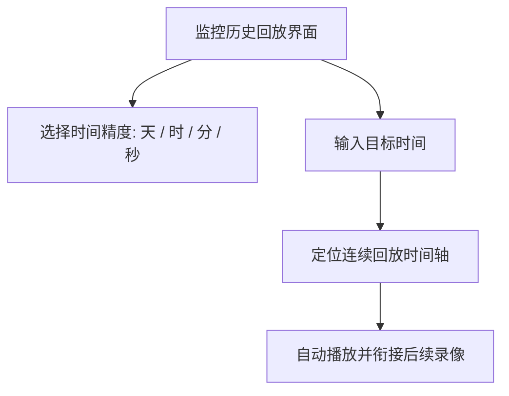

# 05-实时视频监控与历史回放

【监控】按小组管理视频源，提供实时查看、封面快照和多粒度录像时间轴。设备离线后，可继续查看留存的历史录像。

---

## 1. 监控设备列表网格

进入底部导航栏【监控】页面：

- **小组设备筛选**：顶部自动联动您当前所在的小组，仅展示当前安防小组拥有的摄像头设备。
- **设备网格卡片**：每个监控卡片包含：
  - **摄像头名称**：例如“东门入口高清球机”、“3楼走廊摄像头”。
  - **画面封面快照**：系统后台定期抓取的最新画面缩略图。
  - **在线状态标签**：绿色标示在线，灰色标示离线。
- **自动模式切换**：时间轴位于最新位置时自动跟随实时画面；向过去拖动后自动进入历史回放。视频源地址仅由有管理权限的成员配置，不会展示给普通查看者。

---

## 2. 模式一：实时视频直播

- **流媒体播放**：点击监控卡片的播放按钮进入播放页面，底栏收起；点击左上角返回按钮回到监控列表。页面内可实时查看摄像头视频推流。
- **定时封面刷新**：系统后台会定期（每 1 分钟）自动抓取并更新摄像头的封面快照，让您无需点击播放即可了解各监控区域的大致动态。

---

## 3. 模式二：多粒度历史视频回放与时间轴定位

排查过去的画面时，在监控播放页向过去拖动时间轴，或输入目标时间并点击【跳转定位】。选择有录像的时间段后即可回放。

```mermaid
graph TD
    PlaybackUI[监控历史回放界面] --> Granularity[选择时间精度: 天 / 时 / 分 / 秒]
    PlaybackUI --> JumpTime[输入目标时间]
    JumpTime --> Timeline[定位连续回放时间轴]
    Timeline --> PlayVideo[自动播放并衔接后续录像]
```

### 3.1 四级时间轴精度

系统提供 **【天】、【时】、【分】、【秒】** 四种时间轴精度。选择后会同时改变查询窗口和滑块步长：粒度越细，看到的时间范围越小，便于精确定位。切换精度保留当前定位时刻，重新加载附近录像；拖到显示窗口边缘后，会以新的定位时刻调整窗口。离线监控也可以在已有录像范围内这样浏览。

时间轴统一展示录像，可播放范围由亮色轨道标记，断流或没有录像的时段显示为缺口。

- **天**：适合快速定位某一天；
- **时**：适合排查某个时段；
- **分**：适合浏览事件前后画面；
- **秒**：适合精准回到事件发生时刻。

### 3.2 可回放范围与连续回放

1. **时间输入跳转**：直接输入目标日期时间（如 `2026-07-23 14:30:00`），点击【跳转定位】。
2. **可回放范围**：时间轴上的亮色轨道代表可回放录像，暗色部分代表断流或尚无录像。
3. **连续回放**：拖动时间轴至任意亮色时刻即可播放。正在写入的最近一分钟也会逐步出现在亮色轨道中，播放器追到最新位置后自动返回实时画面。
4. **无录像反馈**：选择暗色缺口时，播放器直接黑屏并显示“无回放录像”，不会残留上一时刻的画面。
5. **留存说明**：实际留存时长由部署方的磁盘容量与保留策略决定。

向过去拖动或输入历史时间后，页面切换到回放；定位到最新时间或点击【回到实时】后，页面恢复实时画面并跟随最新时间。加载期间请等待播放器响应；“无回放录像”表示所选时刻没有可播放录像。

---

## 4. 添加与管理监控摄像头

组长及有权限的用户可在当前安防小组下添加与编辑摄像头：

1. 点击监控界面右上角【+ 添加】按钮。
2. 填写摄像头参数信息：
   - **设备名称**：为该摄像头指定清晰易识记的名称。
   - **视频流地址**：支持填写 RTSP、RTMP、HTTP-FLV、HLS 或 MP4 测试视频流地址。
3. 点击【添加视频源】。服务器会尝试拉流并建立录像；地址不可达或无法解码时不会产生有效历史录像。

卡片上的编辑与删除入口用于管理设备；删除前应核对目标并阅读确认提示。从监控录像截取调查片段，在[工作区的截取页面](06-workspace-management.md#_2-从视频源截取片段)操作，不在监控页直接发起问答。
