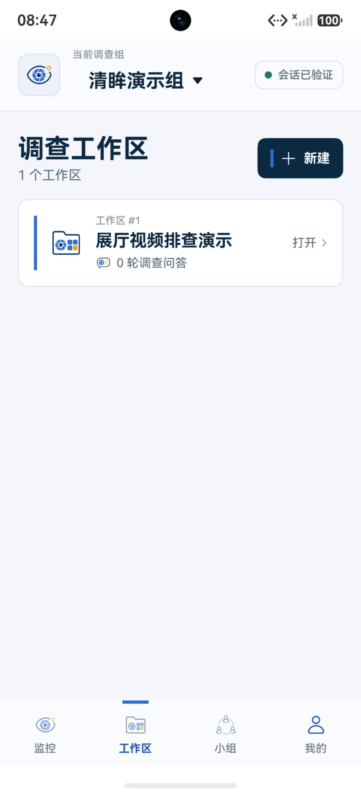
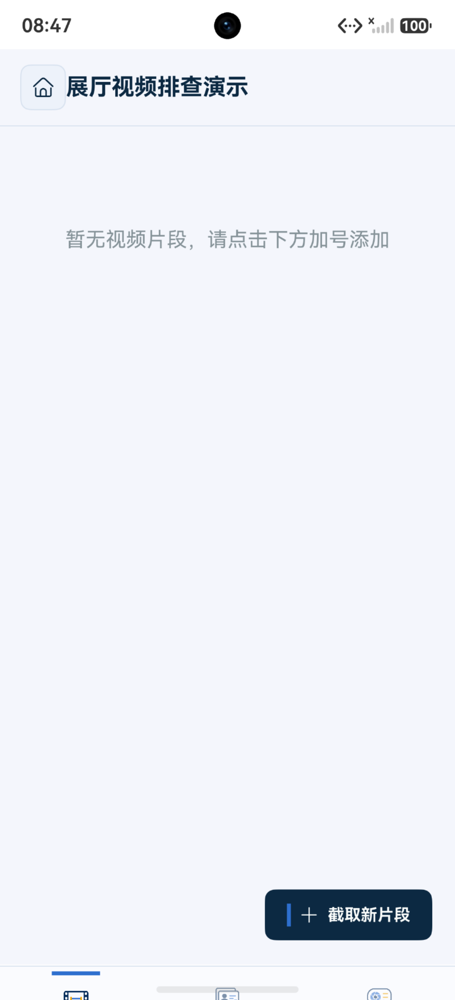

# 06-工作区管理与视频片段

工作区按小组共享，用来整理监控录像、上传视频、截取片段、人脸线索和调查记录。进入工作区详情后，可以在【片段 | 人脸 | 问答】三个页面之间切换；调查 Agent 的使用见[下一章](./07-ai-multimodal-qa.md)。

## 1. 创建和打开工作区

在底部【工作区】页面选择小组，点击【新建】，输入名称后创建。同一小组中已加入的成员可以查看该小组的工作区及其片段和调查记录；尚未接受邀请的用户不能访问。

下图是本地演示小组中刚创建的“展厅视频排查演示”工作区，卡片会显示调查问答轮数。

## 2. 从视频源截取片段

进入工作区的【片段】页，点击【截取新片段】，选择视频源。列表可能包含同组监控设备的历史录像、当前工作区已上传的视频，以及服务器提供的示例视频（如果部署了示例文件）。没有录像的监控设备不会凭空产生可截取的内容。

演示环境尚未接入或上传视频，因此详情页如实显示“暂无视频片段”。下方按钮是下一步操作入口；需要先有可用的视频源，才能展示片段、预处理和调查问答结果。

- **监控录像**：指定起止日期时间，从该监控设备的历史录像中截取并拼接对应时段。
- **上传／示例视频**：选择文件，设定片内起始和结束时间；结束时间必须晚于开始时间，单个片段最长两小时。
- **备注**：可以为片段填写说明，以便以后在列表中辨认。

截取后会生成独立的视频片段。片段详情提供播放、备注编辑和特征预处理管理，也有删除片段入口。上传接口接受 MP4、AVI、MOV、MKV、WebM；具体可选视频源取决于当前工作区和服务器上的文件。

## 3. 可选的 AI 特征预处理

截取时可开启【AI 特征提取与识别预处理】，也可以先截取，随后在片段详情中手动开始预处理。界面提供 **0.5、1.0、2.0 FPS** 采样率，以及 **480P、720P、1080P、4K** 预处理画质；默认是 1.0 FPS 和 1080P。较高的采样率、画质或较长的片段会增加处理时间。

片段状态包括：

| 状态 | 含义 | 可进行的操作 |
| :--- | :--- | :--- |
| `none` | 未预处理，或特征已删除 | 开始预处理 |
| `pending` / `processing` | 等待或正在提取特征 | 查看进度，等待结束 |
| `completed` | 特征已建立 | 查看预处理配置，或删除特征后重做 |
| `failed` | 预处理失败 | 查看错误原因，调整参数并重新预处理 |

删除**预处理特征**会清除对应的检索索引和人脸线索，并将片段恢复为未预处理状态，保留视频片段本身。删除**片段**会移除视频文件及关联特征；被调查记录引用的片段需保留，不能直接删除。等待或正在预处理、或正在被调查使用的片段，也不能删除或重做特征。

问答可以选用尚未建立索引的片段；正在预处理的片段需要等待该次处理结束，才可提交新问题。特定检索工具能否返回结果仍取决于相应特征和模型是否可用。

## 4. 人脸线索

【人脸】页将预处理得到的人脸按卡片展示。可以按视频片段筛选分组；打开卡片后可输入 `mm:ss` 时间范围筛选出现记录，预览抓拍图，或点击记录跳到对应片段播放。误分组时，可将一条记录单独成组、移到其他分组，或将整个分组合并到另一组。片段正在预处理时暂不能修改分组；重新预处理会重建该片段的记录，先前对该片段的人工调整需要重新检查。

人脸归类有两种由**后端配置**指定的方式：**服务端模型**使用 YuNet 检测与 SFace 特征比对；**鸿蒙手机端**由服务端先抓拍视频中的人脸，手机再使用 Core Vision Kit 对抓拍图比对归类。应用只显示当前方式，用户和管理员均不能在应用内切换。在鸿蒙模式下，预处理后会显示“等待鸿蒙手机归类”；任意已加入工作区的小组成员可在该页点击“使用本机鸿蒙人脸能力归类”，等待手机完成并上传结果。需要保持应用前台及网络连接，中断后可重新继续剩余记录。后端更改配置不会自动重算已有记录。

归类结果属于视频线索，不等同于真实身份鉴定。旧版颜色归类的记录标为“旧版线索 · 待重建”，重新预处理后才会使用当前模式。服务端模式没有配置人脸模型时片段预处理会显示失败原因；管理员需设置模型路径后重试，见[部署说明](../server-deployment/01-requirements-and-env.md)。

## 5. 桌面调查卡片

在手机桌面为清眸添加 2×2「清眸调查」服务卡片后，打开工作区的调查页，卡片会显示最近查看的调查状态、工具步骤数和上次同步时间。点击卡片可以回到对应工作区的调查轮次，登录状态会先由服务器验证。卡片不显示监控画面、问题或结论；应用未打开调查页时不会持续获取新进度，因此应以上次同步时间判断信息是否仍新鲜。退出登录后卡片会清空。
