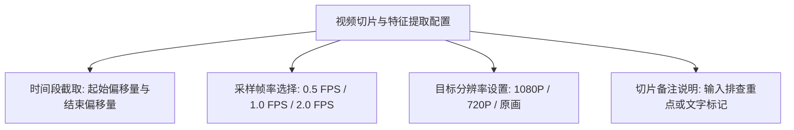

# 06-工作区管理与视频切片

【工作区】是 Pureyes 进行高阶 AI 多模态视觉分析的核心工作台。用户可以在工作区中导入多段安防监控录像视频、进行智能视频切片截取，并配置采样帧率与分辨率参数。

---

## 1. 工作区列表与创建

进入底部导航栏【工作区】界面：

1. **工作区卡片列表**：按小组成员共享展示所有工作区，每个工作区卡片显示工作区名称、创建人以及关联的视频片段数量。
2. **新建工作区**：点击右上角【新建工作区】，输入工作区名称（例如：“2026-07-23 展厅包裹遗失排查”），关联当前安防小组后完成创建。

---

## 2. 视频导入与智能切片

点击进入工作区详情页面：

### 导入视频文件
- 支持从手机本地相册导入录像、或直接关联摄像头抓拍录像。
- 上传视频后，系统自动解析视频基本属性（总时长、分辨率、编码格式等）。

### 智能视频切片参数设置
在视频详情切片面板中，您可以精细配置以下特征提取与切片参数：

1. **时间段截取**：拖动时间轴滑块或直接输入起始偏移量与结束偏移量，精准截取需要排查的视频片段。
2. **采样帧率**：默认为每秒抽抓 1 帧用于大模型推理，在提高检索效率的同时节省计算资源。
3. **目标分辨率**：支持切换 1080P / 720P / 原画，自动完成转码与压缩。

---

## 3. 特征提取状态与实时进度条

提交切片分析任务后，后端异步线程将启动目标检测与特征提取：

- **等待中**：任务已入列，准备开始抽取视频帧。
- **处理中**：界面呈现百分比动态进度条，实时刷新当前解析进度。
- **已完成**：特征数据生成完毕，视频卡片亮起绿色就绪图标，可立即进行 AI 多模态视觉问答。
- **失败**：若视频编码不兼容，系统会显示明确的错误信息。

---

## 4. 人脸识别分类与连贯时间段轨迹

工作区底部导航已升级为【片段 | 人脸 | 问答】三 Tab 架构，新增鸿蒙端云联动的**人脸识别分类与连贯时间段聚合**模块：

1. **人脸识别分类**：在切片预处理时自动开启人脸检测与跨视频归类，将同一人在不同视频或不同时段的抓拍归类为独立的人脸卡片（如 `人脸 #1`、`人脸 #2`）。
2. **时间段连贯聚合**：算法会自动将连续或短微间隔（$\le 3.5\text{s}$）内的人脸轨迹合成为**一条连贯的时间段记录**（如 `00:10 - 00:25`），拒绝将时间拆成零散碎片。
3. **三级联动交互**：
   - **人脸块**：以 2 列网格呈现人脸头像与记录数。
   - **轨迹明细与大图**：点击卡片查看所有出现的视频与起止时间段，点击左侧人脸抠图可调起**全屏大图预览**。
   - **精准播放跳转**：点击某条轨迹记录，播放器自动弹起并**精准跳帧至起始时间播放**。

---

> [!TIP]
> 经过采样与特征提取后的视频片段，后续进行大模型自然语言提问时，响应速度将提升 5 至 10 倍！

