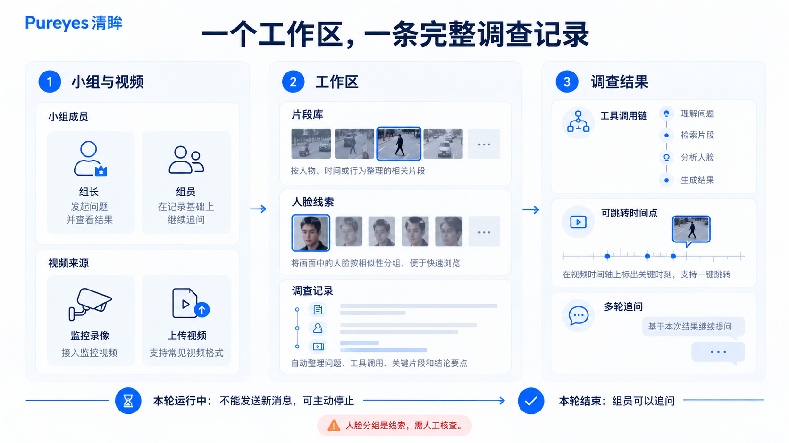

# 06-工作区管理与视频片段

工作区按小组共享，用来整理监控录像、上传视频、截取片段、人脸线索和调查记录。进入工作区详情后，底栏始终提供【片段 | 人脸 | 问答】三个主页面；点击【截取新片段】或进入某条调查、创建新调查后，会进入无底栏的子页面，使用顶部返回按钮回到原主页面。人脸和片段详情以弹窗打开。调查 Agent 的使用见[下一章](./07-ai-multimodal-qa.md)。

上图是工作区关系示意，不是应用截图；下方的设备截图展示实际入口。

## 1. 创建和打开工作区

在底部【工作区】页面选择小组，点击【新建】，输入名称后创建。同一小组中已加入的成员可以查看该小组的工作区及其片段和调查记录；尚未接受邀请的用户不能访问。

下图是本地演示小组中刚创建的“展厅视频排查演示”工作区，卡片会显示调查问答轮数。

## 2. 从视频源截取片段

进入工作区的【片段】页，点击【截取新片段】，选择视频源。列表可能包含同组监控设备的历史录像、当前工作区已上传的视频，以及服务器提供的示例视频（如果部署了示例文件）。没有录像的监控设备不会凭空产生可截取的内容。

演示环境尚未接入或上传视频，因此详情页如实显示“暂无视频片段”。下方按钮是下一步操作入口；需要先有可用的视频源，才能展示片段、预处理和调查问答结果。

- **监控录像**：指定起止日期时间，从该监控设备的历史录像中截取并拼接对应时段。
- **上传／示例视频**：选择文件，设定片内起始和结束时间；结束时间必须晚于开始时间，单个片段最长两小时。
- **备注**：可以为片段填写说明，以便以后在列表中辨认。

截取后会生成独立的视频片段。片段详情提供播放、备注编辑和特征预处理管理，也有删除片段入口。上传接口接受 MP4、AVI、MOV、MKV、WebM；具体可选视频源取决于当前工作区和服务器上的文件。

## 3. 可选的 AI 特征预处理

截取时可开启【AI 特征提取与识别预处理】，也可以先截取，随后在片段详情中手动开始预处理。界面提供 **0.5、1.0、2.0 FPS** 采样率，以及 **480P、720P、1080P、4K** 预处理画质；默认是 1.0 FPS 和 1080P。较高的采样率、画质或较长的片段会增加处理时间。

片段状态包括：

| 状态 | 含义 | 可进行的操作 |
| :--- | :--- | :--- |
| `none` | 未预处理，或特征已删除 | 开始预处理 |
| `pending` / `processing` | 等待或正在提取特征 | 查看进度，等待结束 |
| `completed` | 特征已建立 | 查看预处理配置，或删除特征后重做 |
| `failed` | 预处理失败 | 查看错误原因，调整参数并重新预处理 |

等待和正在预处理的片段也会留在【片段】列表。正在预处理时显示进度条、百分比，以及根据最近两次可用进度估算的“约 %/分钟”；这是客户端对进度变化的估计，不是模型实际处理帧率。服务端尚未报告新的进度时显示等待提示。加载失败时保留上次列表并允许重试。

删除**预处理特征**会清除对应的检索索引和人脸线索，并将片段恢复为未预处理状态，保留视频片段本身。删除**片段**会移除视频文件及关联特征；被调查记录引用的片段需保留，不能直接删除。等待或正在预处理、或正在被调查使用的片段，也不能删除或重做特征。

问答可以选用尚未建立索引的片段；正在预处理的片段需要等待该次处理结束，才可提交新问题。特定检索工具能否返回结果仍取决于相应特征和模型是否可用。

## 4. 人脸线索

【人脸】页将预处理得到的人脸按卡片展示。可以按视频片段筛选分组；打开卡片后可输入 `mm:ss` 时间范围筛选出现记录，预览抓拍图，或点击记录跳到对应片段播放。误分组时，可将一条记录单独成组、移到其他分组，或将整个分组合并到另一组。片段正在预处理时暂不能修改分组；重新预处理会重建该片段的记录，先前对该片段的人工调整需要重新检查。

人脸线索可能由服务端处理，也可能需要使用鸿蒙手机完成归类。应用会显示当前可用的方式，无需手动切换。如果片段显示“等待鸿蒙手机归类”，小组成员可点击【使用本机鸿蒙人脸能力归类】，保持应用在前台并等待上传完成；中断后可以继续处理剩余记录。

归类结果只是视频线索，不等同于身份鉴定。标为“旧版线索 · 待重建”的记录需要重新预处理；如果预处理失败，可根据页面原因重试，或联系维护人员。

## 5. 桌面调查卡片

在手机桌面为清眸添加 2×2「清眸调查」服务卡片后，打开工作区的调查页，卡片会显示最近查看的调查状态、工具步骤数和上次同步时间。点击卡片可以回到对应工作区的调查轮次，登录状态会先由服务器验证。卡片不显示监控画面、问题或结论；应用未打开调查页时不会持续获取新进度，因此应以上次同步时间判断信息是否仍新鲜。退出登录后卡片会清空。
