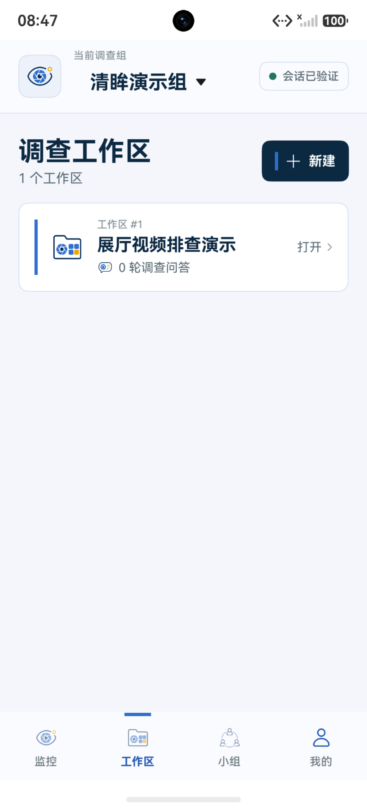
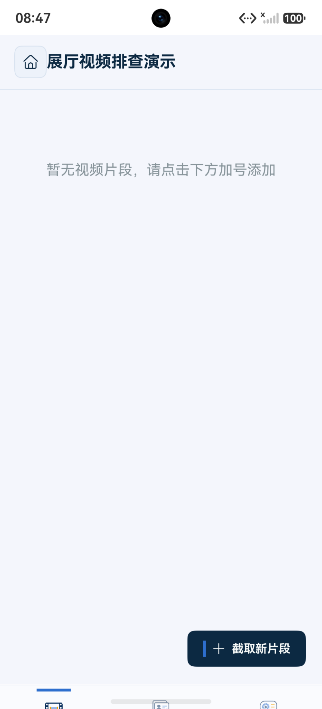

# 06-工作区管理与视频片段

工作区按小组共享，用来整理监控录像、上传视频、截取片段、人脸线索和调查记录。进入工作区详情后，底栏始终提供【片段 | 人脸 | 问答】三个主页面；点击【截取新片段】或进入某条调查、创建新调查后，会进入无底栏的子页面，使用顶部返回按钮回到原主页面。人脸和片段详情以弹窗打开。调查 Agent 的使用见[下一章](./07-ai-multimodal-qa.md)。

片段、人脸和问答共享同一工作区的视频与调查资料。

## 1. 创建和打开工作区

在底部【工作区】页面选择小组，点击【新建】，输入名称后创建。同一小组中已加入的成员可以查看该小组的工作区及其片段和调查记录；尚未接受邀请的用户不能访问。

工作区卡片显示名称和调查问答轮数，点击卡片进入详情。

## 2. 从视频源截取片段

进入工作区的【片段】页，点击【截取新片段】，选择视频源。可选来源包括同组监控的已有录像、当前工作区上传的视频，以及服务器提供的示例视频。

工作区没有片段时显示“暂无视频片段”，点击【截取新片段】开始添加。

- **监控录像**：指定起止日期时间，从该监控设备的历史录像中截取并拼接对应时段。
- **上传／示例视频**：选择文件，设定片内起始和结束时间；结束时间必须晚于开始时间，单个片段最长两小时。
- **备注**：可以为片段填写说明，以便以后在列表中辨认。

### 上传手机里的视频

在【截取新片段】页面点击【选择视频】，选择【从相册选择】或【从文件选择】。支持 MP4、AVI、MOV、MKV、WebM，客户端允许单个文件不超过 2 GB；服务器可能设置更小的限制。上传时显示进度，请保持网络连接。

上传成功后自动打开视频预览与截取设置，可以选取整段或部分时间范围、填写备注，并设置 AI 预处理。上传原视频本身不会启动预处理；确认截取且开启预处理后，才会走与其他片段相同的完整特征提取流程。取消截取不会删除已上传的视频，之后可在该工作区的视频源列表中再次选择。

截取后会生成独立的视频片段。片段详情提供播放、备注编辑和特征预处理管理，也有删除片段入口。具体可选视频源取决于当前工作区和服务器上的文件。

<figure><figcaption>从手机选择本地视频</figcaption></figure>
<figure><figcaption>上传后预览并选择截取范围</figcaption></figure>

上传时会准备临时副本，请预留手机存储空间。手机原文件保留；取消选择器将返回截取页面。上传失败时，根据提示检查网络、格式、大小和剩余空间后重试。上传进度表示文件传输进度，AI 预处理进度在片段列表中查看。

## 3. 可选的 AI 特征预处理

截取时可开启【AI 特征提取与识别预处理】，也可以先截取，随后在片段详情中手动开始预处理。界面提供 **0.5、1.0、2.0 FPS** 采样率，以及 **480P、720P、1080P、4K** 预处理画质；默认是 1.0 FPS 和 1080P。较高的采样率、画质或较长的片段会增加处理时间。

<figure><figcaption>确认截取前设置预处理</figcaption></figure>
<figure><figcaption>播放片段并查看特征状态</figcaption></figure>

预处理按所选采样率扫描视频，建立可反复复用的检索索引：目标与轨迹用于查找人员、车辆的位置与出现时间，语义索引用于检索外观和场景，OCR 用于检索文字，人脸分组用于整理出现记录。遮挡、远距离、低清画面和快速动作可能造成漏检。检索不足时，可在问答中让 Agent 查看原画面；动作与跨视频关联结合前后画面核验。

片段状态包括：

| 状态 | 含义 | 可进行的操作 |
| :--- | :--- | :--- |
| `none` | 未预处理，或特征已删除 | 开始预处理 |
| `pending` / `processing` | 等待或正在提取特征 | 查看进度，等待结束 |
| `completed` | 特征已建立 | 查看预处理配置，或删除特征后重做 |
| `failed` | 预处理失败 | 查看错误原因，调整参数并重新预处理 |

等待和正在预处理的片段显示在【片段】列表。处理期间展示进度条、百分比，以及根据最近两次进度估算的“约 %/分钟”。服务端没有新进度时显示等待提示；加载失败时保留列表并提供重试入口。

删除**预处理特征**会清除对应的检索索引和人脸线索，并将片段恢复为未预处理状态，保留视频片段本身。删除**片段**会移除视频文件及关联特征；被调查记录引用的片段需保留，不能直接删除。等待或正在预处理、或正在被调查使用的片段，也不能删除或重做特征。

问答可以选用尚未建立索引的片段；正在预处理的片段需要等待该次处理结束，才可提交新问题。特定检索工具能否返回结果仍取决于相应特征和模型是否可用。

## 4. 人脸线索

【人脸】页将预处理得到的人脸按卡片展示。可以按视频片段筛选分组；打开卡片后可输入 `mm:ss` 时间范围筛选出现记录，预览抓拍图，或点击记录跳到对应片段播放。误分组时，可将一条记录单独成组、移到其他分组，或将整个分组合并到另一组。片段正在预处理时暂不能修改分组；重新预处理会重建该片段的记录，先前对该片段的人工调整需要重新检查。

人脸线索可能由服务端处理，也可能需要使用鸿蒙手机完成归类。应用会显示当前可用的方式，无需手动切换。如果片段显示“等待鸿蒙手机归类”，小组成员可点击【使用本机鸿蒙人脸能力归类】，保持应用在前台并等待上传完成；中断后可以继续处理剩余记录。

自动分组用于整理人脸线索，合并或拆分前请对照抓拍与原视频。标为“旧版线索 · 待重建”的记录需重新预处理；处理失败时，根据页面原因重试或联系维护人员。

<figure><figcaption>按分组查看抓拍封面</figcaption></figure>
<figure><figcaption>查看跨片段出现时间与抓拍</figcaption></figure>

出现记录使用片段内时间。通过片段筛选器限定查看范围，点击时间点可打开对应原视频。

## 5. 桌面调查卡片

桌面小部件提供 2×2 和 2×4 卡片，支持多个任务切换、手动刷新和空闲总览。卡片显示调查标题与最近同步时间；离开调查页后，应用仍会同步任务状态。添加方式、通知设置与后台同步条件见[调查通知与桌面小部件](10-investigation-notifications.md)。
