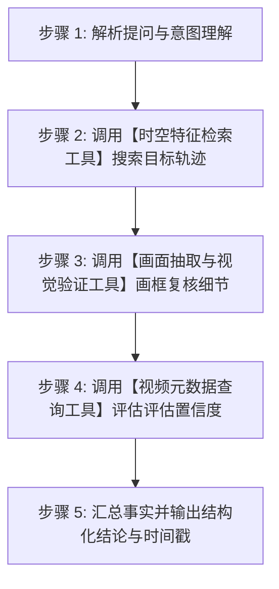
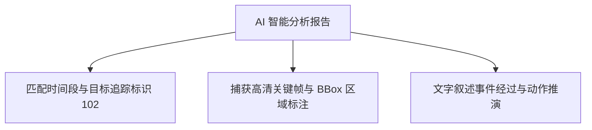

# 07-智能多模态视觉问答

智能多模态视觉问答是 Pureyes 系统的核心亮点。在工作区完成视频切片与特征预处理后，用户可以直接使用自然语言向 AI 提问，系统将由云端多模态视觉大模型结合智能体工具箱与多轮思考机制，深度理解视频内容并精准定位事件。

---

## 1. 对话式视觉问答交互

在工作区详情界面底部，设有智能问答对话框：

1. 选中要分析的一个或多个视频片段。
2. 在输入框中输入您的自然语言检索需求，例如：
   - “视频中穿黑色夹克戴口罩的人是在什么时间点进入房间的？”
   - “画面里有没有人遗留红色背包？帮我找出对应时间段。”
   - “统计视频中一共出现了多少辆白色轿车，并总结其停留时长。”
3. 点击发送按钮或按回车键提交。

> [!NOTE]
> 系统支持用户在【我的】页面中灵活配置大模型 API 密钥、接口地址及模型名称，满足私有部署或个人 API 调用的需求。

---

## 2. AI 分析的具体过程

当您提交提问后，AI 并不是简单地粗暴猜测，而是通过一套严密的**“思考 - 工具调用 - 观察验证 - 得出结论”**多轮分析流程来推演真相：

---

## 3. AI 的三大专属工具箱

为了保证回答的真实性与客观性，AI 在分析过程中可以使用以下 3 个专属工具：

### 3.1 时空特征检索工具
- **主要作用**：在海量视频数据中进行全局快速搜寻，具备两种检索模式：
  1. **语义与动作搜索模式**：当您询问“穿红衣服的人什么时候出现”时，AI 调用此模式快速检索符合关键词特征的目标与时间段。
  2. **目标追踪与跨镜头重识别模式**：当您询问“追查 102 号目标人员在其他视频片段中的移动轨迹”时，AI 调用此模式提取该目标的特征向量，在工作区所有视频中进行跨镜头相似度匹配，生成连贯的时间移动轨迹图谱。

### 3.2 画面抽取与视觉验证工具
- **主要作用**：调取特定秒数的高清画面并进行视觉复核。
- **使用场景**：在锁定大致时间段后，AI 调用此工具截取关键秒数的图像，并在画面上自动画框标注目标区域，犹如用放大镜再次仔细核对画面细节，确保万无一失。

### 3.3 视频元数据查询工具
- **主要作用**：查询视频片段的基础物理属性。
- **使用场景**：获取视频的总时长、帧率与解析精度。如果当前视频未进行预处理或采样帧率较低，AI 会在结论末尾自动提醒您提升预处理精度以获取更精细的特征。

---

## 4. 分析报告生成与精准定位

经过上述工具箱验证后，系统将在数秒内返回结构化的分析结果：

- **精准时间戳**：自动算出事件发生的绝对时间与相对时间偏移。
- **目标追踪标识**：为运动目标标记唯一的追踪序号。
- **一键跳转播放**：点击时间戳标记，视频播放器直接自动跳转至该秒数播放。
- **关键帧快照**：自动提取 AI 判定度最高的高清关键帧图片供查看。

---

## 5. 问答历史记录留存与共享

- **问答历史持久化**：所有提问与 AI 返回的分析结果均自动保存在当前工作区中。
- **团队同组共享**：同一个安防小组内的所有成员进入该工作区后，均可实时查阅历史问答记录与分析结果，方便协作排查。
