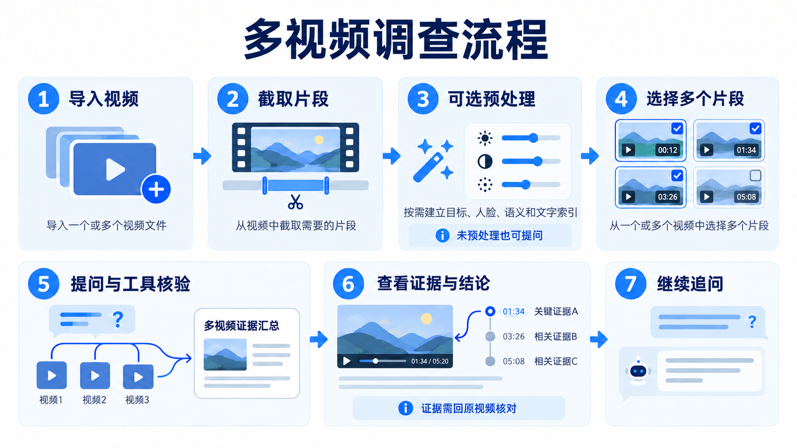

# 07-工作区调查 Agent 与连续追问

工作区【问答】页是共享的调查工作台。每条调查线固定一组视频片段作为证据范围，记录各轮问题、工具执行过程与结论。已加入该小组的成员都能打开调查线并在上一轮结束后继续追问。

上图是操作流程示意；视频画面、时间与问题均为示例。实际证据以本轮执行记录和原视频为准。

## 1. 建立调查线

1. 打开工作区【问答】页，点击【+ 新建】（首次使用时可点击【开始第一条调查】）。
2. 从当前工作区选择至少一个相关片段，输入问题，在输入框下方选择个人或本小组的模型配置，点击【开始调查】。例如“画面中背黑包的人何时经过门口？”。一次最多选择 20 个片段。
3. 提交后进入调查工作台。调查列表展示标题、轮数、最近一轮状态与问题；打开任一记录可继续查看。

首次选定的片段就是该调查线的证据范围。后续追问自动沿用这组片段，不需要重新选择，也不会自动扩大到工作区的其他视频。每轮追问都可在输入框右下方选择本人的个人配置或当前小组的共享配置；没有可用配置时，先在【我的】→【模型 API】创建，或请组长建立小组配置。配置列表可在问答页刷新。历史轮次会显示提交时所用配置的名称；更改或删除配置不会改变运行中轮次的参数。

<figure><figcaption>会话列表保留工作区底栏</figcaption></figure>
<figure><figcaption>选择本次调查的片段与模型</figcaption></figure>

调查详情顶部的【引用片段 · N】可展开，列出这条调查使用的视频编号、名称和时长；点击【查看】可打开原片段。回答中的“视频 1”“视频 2”对应这个列表的顺序，不是工作区列表的顺序。需要加入其他片段时，请新建另一条调查。

## 2. 查看执行过程和结论

运行中显示当前阶段、已运行时间，以及连贯的【调查过程】：工具步骤以“图标 + 一句摘要”呈现，模型主动输出的公开进度说明穿插其中，用于解释目前发现了什么、接下来准备核对什么。并不是每次工具调用都会有一段说明。

点击工具行右侧【›】，查看中文字段整理后的检索条件、目标编号、各张画面的来源与时间点、观察摘要和证据入口，不需要阅读原始 JSON。模型可能检索目标轨迹、语义、文字、人脸线索或直接核验画面，具体步骤取决于问题和可用索引。

运行结束后调查过程默认收起，优先展示答案；点击【查看调查过程】可再次展开，单次工具步骤也可独立展开。已结束的每轮保留【用时】，不是整条多轮会话的累计时间，也不是预处理耗时。

<figure><figcaption>连贯的调查过程</figcaption></figure>
<figure><figcaption>按需展开中文参数与证据入口</figcaption></figure>

需要对照不同片段时，Agent 也可在一次工具调用中读取最多 4 张来自所选视频的画面；执行记录为成功读取的画面分别提供视频和时间点入口，方便逐一核对。若部分画面截取失败，其余成功画面仍可用于核验。

结论按 Markdown 排版，支持标题、列表、表格、代码和链接。答案中形如 `[video:"1", time:"02:33"]` 的视频时间标记会显示为可点击的定位入口；点击后打开对应片段并跳到指定时间。工具结果和模型回答是调查线索，关键事实应结合原视频核对。

这些“进度说明”是模型面向用户主动输出的调查简报，不是隐藏的内部推理全文；工具记录是经过整理的公开参数与观察结果。未产生工具调用的轮次不会出现工具链。仅凭一帧看到的姿态不能证明一段动作，检索结果也不能直接证明行为或跨镜头身份。

## 3. 组员追问与上下文

上一轮结束后，任何已加入该小组的成员都可在同一调查线中输入追问。运行期间，提问者和其他组员都只能查看进度与执行记录，不能再提交新消息；如需改问，先点击【停止本轮】，随后追问。

追问会带上固定的视频证据范围，以及从已保存轮次重建的有限上下文：优先纳入最近的提问、**已完成**的结论与工具观察，并按关联程度选取部分更早的轮次。较早内容可能只有简短索引；受上下文长度限制，并非整条历史逐字进入模型。停止或失败的轮次会保留记录，但不会被当作已确认结论。

已完成轮次中带时间点的工具线索也会按视频归档。后续追问会按当前问题取回部分相关线索及其来源，帮助 Agent 继续核验。人脸、目标、画面语义和文字索引都是候选线索；单帧描述仍需复核，不能直接据此认定不同视频里的人或事件相同。

## 4. 停止、失败和等待

任一已加入小组的成员都能停止正在运行的一轮；该轮显示【已停止】，调查线随即可继续追问。失败的最新一轮提供【重新尝试这一问】，也可重新组织问题再追问。运行中超过约 90 秒没有新进度时，界面会给出提示，这只是提醒，并不表示任务已经失败。

运行超时或异常会将本轮标记为失败，之后可重试或继续提问。调查与各轮记录保存在工作区中，重新打开后仍可查看历史状态、答案和执行记录。

## 5. 修改标题与删除调查

调查列表右侧的【⋯】提供【修改标题】和【删除记录】。调查创建者、小组创建者或已加入该小组的管理员可以管理记录，其他组员仍可查看和追问。标题不能为空，最多 160 个字符。

删除前会再次确认；删除的是这条调查的全部问答与工具记录，不会删除视频片段、预处理索引或人脸数据。删除无法撤销，也会影响其他组员。正在运行的调查不能直接删除，请先进入会话停止本轮。

<figure><figcaption>会话列表的三点菜单</figcaption></figure>
<figure><figcaption>修改为便于辨认的案件标题</figcaption></figure>

## 6. 调查通知与桌面小鸮

首次发起调查时，应用会申请通知权限；未授权时也可点击问答页上方的【开启通知】，不用重新提问。允许后，运行中的调查显示阶段、用时和工具步骤数；完成、失败或停止时发送结果通知。点击通知可返回对应调查，不会在通知中显示问题或结论。多条调查分别更新通知，不必停留在某一条会话里。

桌面添加【清眸调查】服务卡片后，小鸮会随状态变换：调查中查看线索、完成时展示勾号、空闲时待命。卡片支持 2×2 和 2×4 尺寸；有多个任务时，点击左右箭头切换，点击中间内容进入调查。没有运行任务时显示调查总数和已完成数（按每条调查的最新一轮统计），也可查看最近记录。卡片显示调查标题，添加到桌面前请考虑标题是否含有敏感信息。

进度展示的是实际阶段、用时和步骤数，不是预计完成百分比。卡片底部显示最近同步时间，右上角【↻】可手动刷新。系统允许后台同步时，离开应用仍可更新；若关闭通知、取消后台任务、网络断开或强制关闭应用，通知和卡片更新可能延迟。重新打开应用或刷新卡片可获取最新状态。退出登录会清空卡片并取消本应用的调查通知。

完整添加步骤、后台限制与常见问题见[调查通知与桌面小鸮](10-investigation-notifications.md)。

## 7. 怎样提出可核验的案件问题

先交代需要核查的事件，给出必要的目标线索，不必替 Agent 罗列每一次抽帧操作。例如：

- 首问：“这几段录像里有没有人把两轮车装上货车运走？指出关键证据。”
- 追问：“装车和驶离分别是什么时候？能看清车辆或人员的哪些特征？”
- 再追问：“另一段夜间录像中的车，能确认是同一辆吗？如果不能，还缺什么证据？”

这些是问题写法示例，不预设视频一定发生过事件。要求区分“看到的事实”“可能的关联”和“无法确认的部分”；遇到检索遗漏，允许 Agent 直接查看原画面。运行时间因片长、视频数量、工具选择、网络和模型而不同，更多工具调用不必然表示证据更充分。
