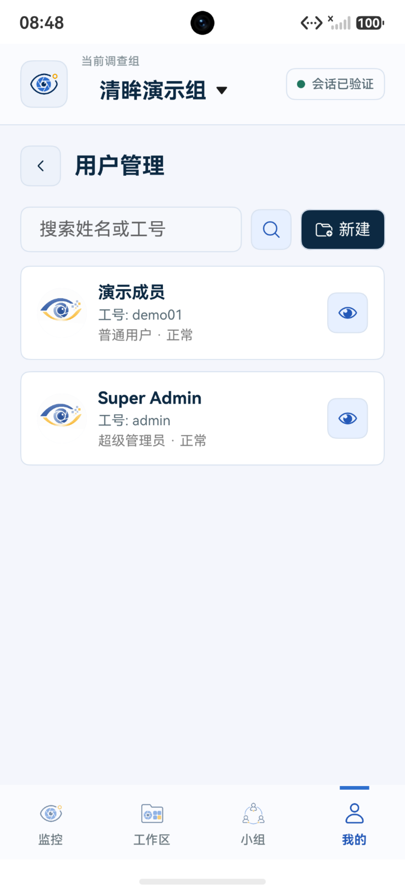

# 用户管理（管理员）

只有管理员和超级管理员能在【我的】看到【用户管理】。这里管理的是登录账号；小组成员邀请和小组配置由小组长在相应页面操作，与管理员角色分开。

| 操作 | 普通用户 | 管理员 | 超级管理员 |
| :--- | :---: | :---: | :---: |
| 查看个人资料、加入小组 | 可以 | 可以 | 可以 |
| 创建账号、初始化密码、停用或删除可操作账号 | — | 可以 | 可以 |
| 调整普通用户与管理员身份 | — | — | 可以 |

下图是本地演示账号创建后的设备界面，展示普通成员与超级管理员两条记录。

## 查找与创建账号

在【我的 → 用户管理】搜索姓名或工号，打开用户卡片查看详情。点击【新建】创建账号，填写工号、姓名、手机号（选填）和至少 6 位的初始密码，并将登录信息提供给使用者。普通账号创建后可通过小组邀请加入团队。

<figure><figcaption>查询账号</figcaption></figure>
<figure><figcaption>创建新账号</figcaption></figure>

## 管理现有账号

在用户详情中，管理员可以初始化密码、停用或启用账号，以及删除允许操作的账号。初始化密码时输入新密码并再次确认，再将新密码交给使用者；原有登录状态会失效。

超级管理员还可以在用户详情中调整普通用户与管理员身份。页面会隐藏或禁用无权限的操作；不能操作当前账号或内置超级管理员。
