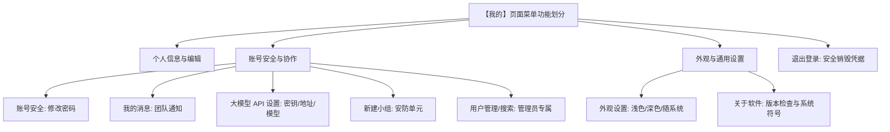

# 09-个人中心与系统设置

【我的】模块是用户管理个人资料、查看安全状态、调整大模型 API 配置、客户端设置以及访问管理控制台的总入口。

---

## 1. 个人资料卡片

在【我的】页面顶部，呈现精致的个人资料卡片：

- **用户头像**：显示默认系统头像或自定义上传的头像图片。
- **姓名与角色勋章**：清晰标示当前登录用户的姓名以及角色（如：`超级管理员` / `管理员` / `普通用户`）。
- **工号与手机号**：展示用户绑定的唯一工号与联系电话。
- **编辑资料**：点击头像旁边的编辑图标，可更新姓名、手机号以及个人头像。防误清空机制保证未填项不会覆写原有资料。

---

## 2. 大模型 API 设置

进入【我的】→【模型 API】，可以建立多条命名配置。每条配置包含：

- **API 密钥**：输入您的多模态大模型服务 API 密钥。
- **接口基础地址**：输入大模型服务接口的基础地址（如兼容 OpenAI 格式或各主流大模型厂商的 API 接口 URL）。
- **大模型名称**：指定要使用的大模型名称。

选择【个人配置】时，只有本人能编辑、删除和使用；小组长还可以选择自己创建的小组，建立【小组配置】。已加入该小组的成员都能在该小组工作区的问答输入框下方选择共享配置，只有小组长能编辑和删除。普通管理员及超级管理员身份本身不授予修改权限。

列表可查看配置名称、模型与地址，点击【编辑】更新；编辑时 API Key 留空表示保持原密钥。密钥始终不会回显。删除配置后，新问题不能再选择它；已经运行的轮次按提交时固定的参数继续执行。既有的单条个人配置会在服务端升级时迁移为名为“原有配置”的个人配置。

---

## 3. 系统功能菜单划分

【我的】页面采用了清晰内聚的模块化分组：

---

## 4. 外观与系统符号设置

- **鸿蒙系统符号**：应用全面适配鸿蒙系统原生矢量系统符号资源，图标大小、色彩随深色/浅色主题智能自适应变化。
- **语言与国际化**：支持中文简体与英文系统语言自适应。
- **版本检查**：在【关于软件】中可一键检测更新，确保客户端始终处于最新稳定版本。
